# Chapter 20 質譜法 (Mass Spectrometry) 超詳細筆記

> 化學系大三期末複習專用，逐頁講解，每一頁都不放過。

---

## Page 1: Chapter 20 Mass Spectrometry（標題頁）

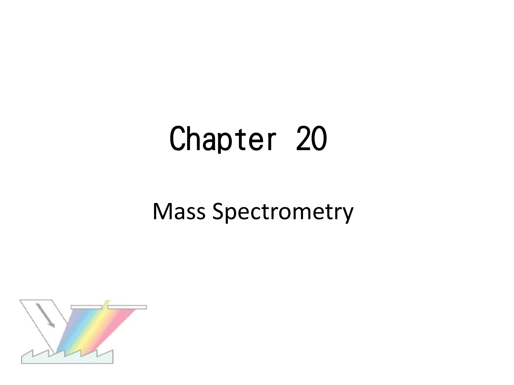

這就是本章的開門見山頁——**質譜法（Mass Spectrometry, MS）**。

質譜是儀器分析中最強大的結構鑑定工具之一，跟 NMR、IR 合稱「結構鑑定三巨頭」。這章要學的核心是：**怎麼把分子打碎，然後從碎片反推原本的分子長什麼樣。**

🔑 **重點提示**：質譜跟光譜類技術（UV、IR、NMR）不同，它不是「看光吸收」，而是「打碎分子，秤碎片重量」。

---

## Page 2: 儀器分析地圖

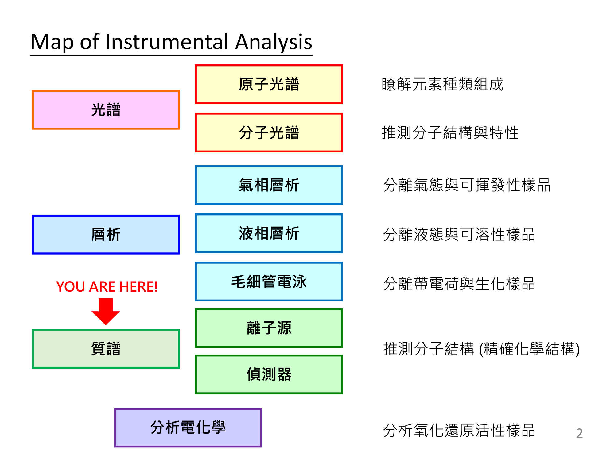

這頁是整學期的儀器分析地圖，質譜位在「**推測分子結構（精確化學結構）**」這個位置。

地圖從左到右是：
- 元素組成 → 官能基 → 精確結構
- 每個層級都有對應的分析技術

質譜能告訴你：**分子量是多少、有哪些碎片、分子式可能是什麼**。配合 NMR 和 IR，就能把完整結構拼出來。

🔑 **重點提示**：記住「YOU ARE HERE」——質譜負責的是「精確化學結構」這一層，比 UV 和 IR 更深入。

---

## Page 3: 歷史 — Dalton & Cannizzaro

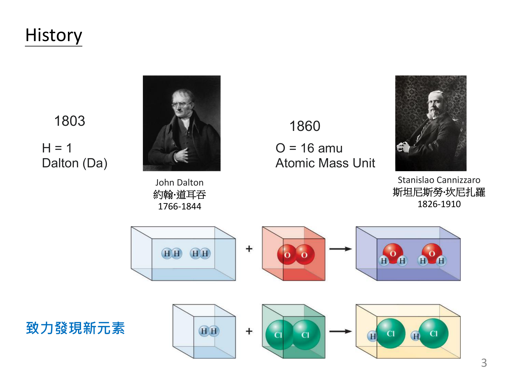

**Dalton（1803）**：
- 提出原子論，把氫的原子量定為 1（H = 1）
- 這就是 **Dalton（Da）** 這個單位的由來
- 1 Da = 1 amu（原子質量單位）

**Cannizzaro（1860）**：
- 用氧定標準，O = 16 amu
- 這個標準用了很久，直到後來改成以碳-12為基準（12C = 12 amu）

🧠 **記憶口訣**：Dalton 定 H=1 是老祖先，Cannizzaro 用 O=16 做標準化。後來國際改用 12C=12 才是今天的標準。

---

## Page 4: 歷史 — Aston 與第一台質譜儀

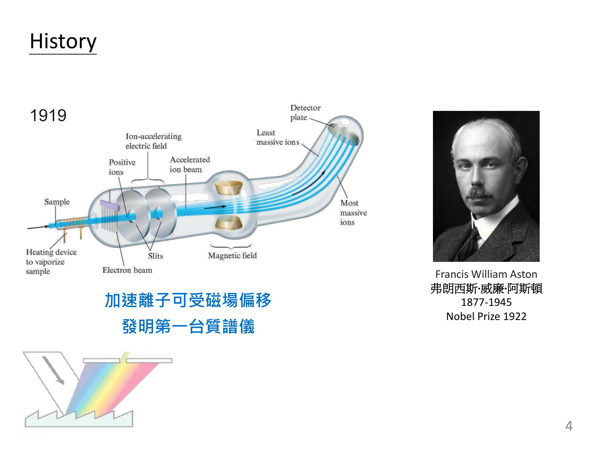

**Aston（1919）**：
- 發明了第一台質譜儀
- 用來分離和測量同位素的質量
- 因此獲得 **1922 年諾貝爾化學獎**

質譜儀的起源是為了研究同位素！Aston 發現同一元素可以有不同的質量（同位素），而質譜儀能把這些差異量出來。

🔑 **重點提示**：考試愛考「誰發明質譜儀？誰得諾貝爾？」答案是 Aston。

---

## Page 5: 質譜儀基本原理

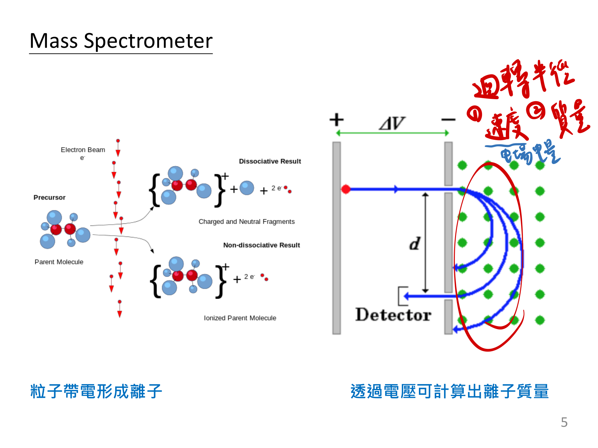

質譜儀的核心邏輯：

1. **讓粒子帶電** → 變成離子
2. **用電壓加速離子** → 離子獲得動能
3. **在磁場或電場中偏轉** → 不同質量的離子偏轉角度不同
4. **偵測器接收訊號** → 轉換成質譜圖

關鍵公式概念：**透過電壓可以計算出離子的質量**。因為動能 KE = zeV（電荷 × 基本電荷 × 加速電壓），知道了動能和速度，就能反推質量。

🧠 **記憶口訣**：帶電 → 加速 → 偏轉 → 偵測，四步走完就是質譜。

---

## Page 6: 週期表

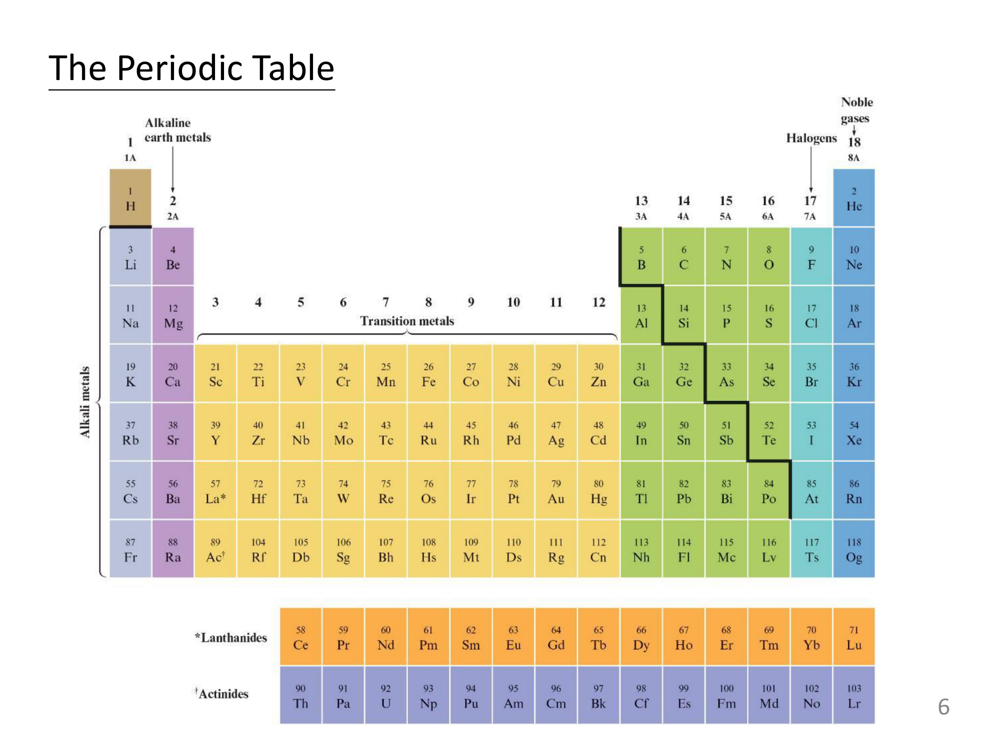

這頁就是元素週期表，提醒你每個元素都有自己的**精確原子量**。

質譜之所以能分辨不同的分子/碎片，就是因為不同元素的質量不同。比如：
- C = 12.000
- H = 1.0078
- O = 15.9949
- N = 14.0031

這些小數點很重要！高解析質譜就是靠這些微小的質量差異來區分不同的分子式。

🔑 **重點提示**：C、H、O、N 的精確質量要背，尤其是 C=12.0000 vs N=14.0031 vs O=15.9949，高解析質譜考題常用。

---

## Page 7: 質譜儀組成

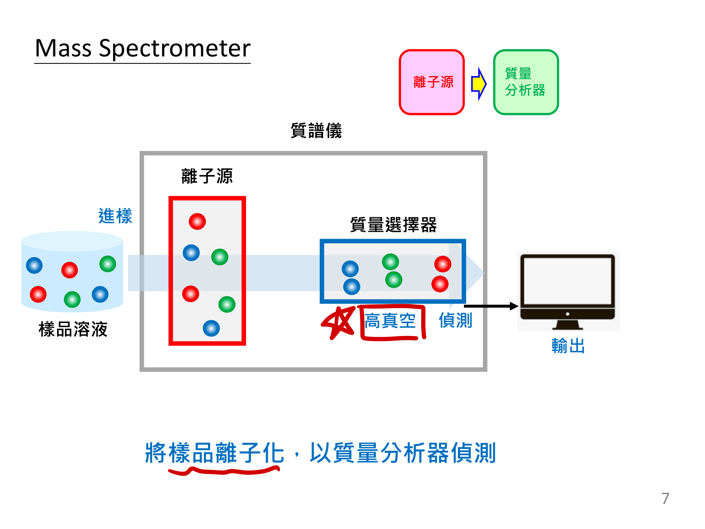

質譜儀四大組成：

1. **離子源（Ion Source）**：把樣品變成離子
2. **質量分析器（Mass Analyzer）**：根據荷質比（m/z）分離離子
3. **偵測器（Detector）**：接收離子，轉成電子訊號
4. **輸出（Output）**：產生質譜圖

**整個儀器必須在高真空環境下運作**，為什麼？
- 避免離子跟空氣分子碰撞
- 確保離子能順利到達偵測器
- 如果不抽真空，離子會被空氣擋住，訊號就亂了

🧠 **記憶口訣**：**離 → 分 → 測 → 出**，四個字記住質譜儀流程。**高真空是命脈**，沒真空就沒質譜。

---

## Page 8: MS 定義

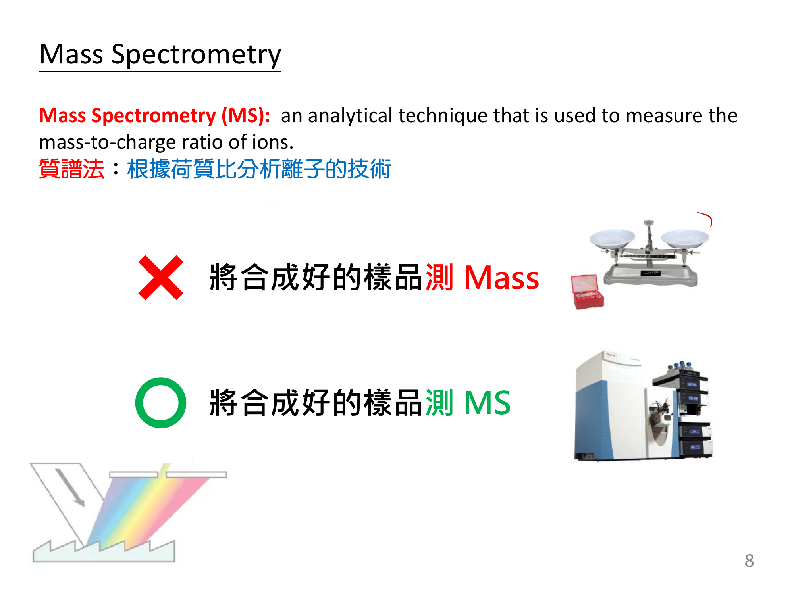

**質譜法（Mass Spectrometry）的定義**：

> 根據**荷質比（mass-to-charge ratio, m/z）** 來分析離子的技術。

- m = 離子的質量（以 amu/Da 為單位）
- z = 離子的電荷數（通常 z = 1，所以 m/z ≈ m）

當 z = 1 時，質譜圖上的數值就等於離子的質量數。但 ESI 等技術可以讓大分子帶多電荷（z > 1），這時候 m/z 會小於實際分子量，需要反推。

🔑 **重點提示**：m/z 是質譜的核心概念，考試一定會考。z=1 時 m/z = m，z=2 時 m/z = m/2。

---

## Page 9: 離子源定義與四種游離方式

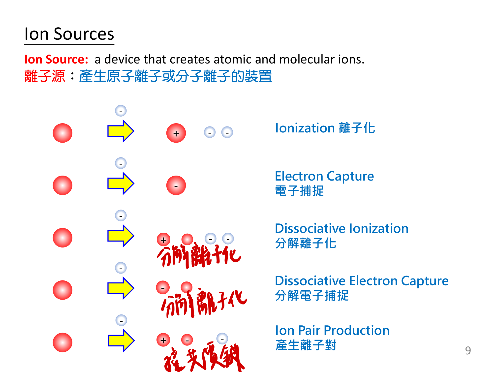

**離子源（Ion Source）**：產生原子或分子離子的裝置。

四種游離方式：

1. **電子捕捉（Electron Capture）**：中性分子抓一個電子，變成陰離子 M + e⁻ → M⁻•
2. **分解電子捕捉（Dissociative Electron Capture）**：抓電子同時分解，AB + e⁻ → A⁻ + B•
3. **分解離子化（Dissociative Ionization）**：被打到直接分解成離子，AB + e⁻ → A⁺ + B⁻ + e⁻
4. **產生離子對（Ion Pair Production）**：一個分子同時產生正負離子，AB + e⁻ → A⁺ + B⁻ + 2e⁻

🧠 **記憶口訣**：**抓電子 → 抓電子兼分解 → 直接分解 → 產生離子對**，由簡到繁排列。

---

## Page 10: 硬離子源 vs 軟離子源

這是質譜最重要的概念之一！

**硬離子源（Hard Ionization）**：
- 能量大，分子被打得很碎
- 碎片多 → 結構資訊豐富，能判斷分子結構
- 但分子離子峰（M⁺•）可能很弱甚至消失 → 分子量難判斷
- 代表：**EI（電子游離）**

**軟離子源（Soft Ionization）**：
- 能量小，分子被打得不太碎
- 分子離子峰很強 → 分子量容易知道
- 但碎片少 → 結構資訊少，難判斷結構
- 代表：**CI、FAB、MALDI、ESI**

🔑 **重點提示**：硬=碎多=結構清但分子量難知；軟=碎少=分子量易知但結構難辨。這是考試萬年考點！

🧠 **記憶口訣**：**硬碎結構清，軟整分子明**。

---

## Page 11: EI 電子游離（Electron Ionization）

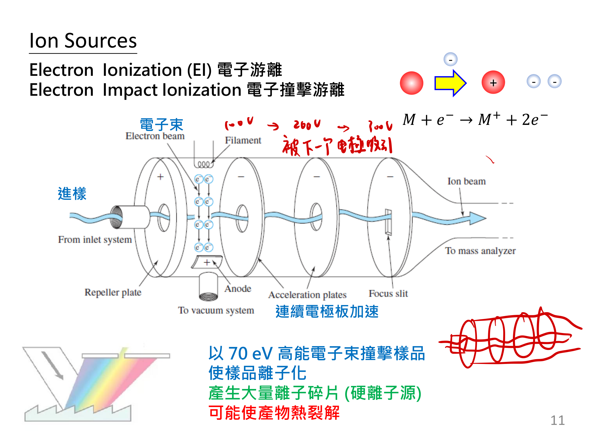

**EI 是最經典的硬離子源**：

- 用 **70 eV** 的電子束撞擊氣態樣品分子
- 反應式：**M + e⁻ → M⁺• + 2e⁻**
- 分子被打掉一個電子，形成**分子離子（Molecular Ion, M⁺•）**
- M⁺• 通常不穩定，會繼續碎裂產生各種碎片離子

為什麼是 70 eV？
- 這個能量遠大於大多數有機分子的游離能（通常 8-15 eV）
- 所以 EI 一定會把分子打碎，是硬離子源的代表

🔑 **重點提示**：70 eV 是 EI 的標準能量，考試愛考。M⁺• 就是分子離子。

---

## Page 12: Example 20-1 — 動能計算

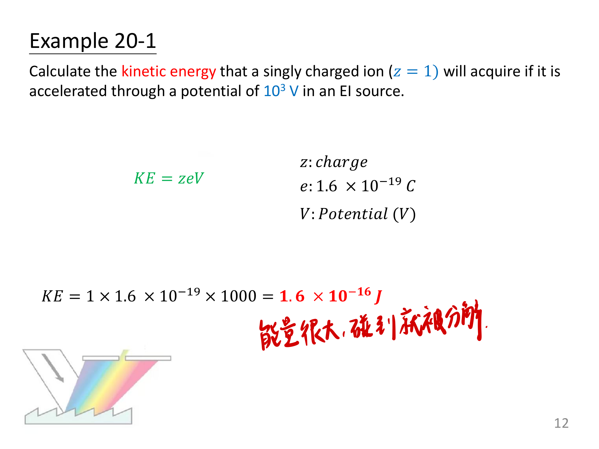

這題在算離子被加速後的動能：

**公式**：KE = zeV

- z = 1（帶一個電荷）
- e = 1.6 × 10⁻¹⁹ C（基本電荷）
- V = 10³ V（加速電壓）

**計算**：
KE = 1 × 1.6 × 10⁻¹⁹ × 10³
KE = **1.6 × 10⁻¹⁶ J**

這個數字看起來很小，但對單一離子來說這能量已經很夠了！

🔑 **重點提示**：KE = zeV 這個公式要背，z 是電荷數，e 是基本電荷，V 是加速電壓。

---

## Page 13: CI 化學游離（Chemical Ionization）

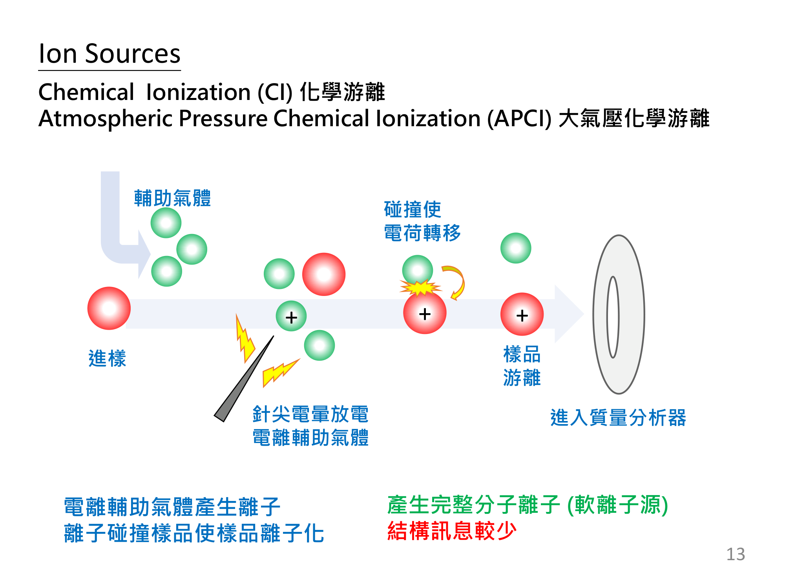

**CI 是軟離子源的代表之一**：

原理跟 EI 不同：
1. 先用電子束游離**試劑氣體**（如甲烷 CH₄）
2. 試劑氣體的離子再去撞擊樣品分子
3. 樣品分子被「溫柔地」游離，不是直接被 70 eV 打

因為是間接游離，能量傳遞較少，所以碎片少、分子離子峰強。

**APCI（Atmospheric Pressure Chemical Ionization）** 是 CI 的大氣壓版本，原理類似但在大氣壓下操作，常用於 LC-MS。

🔑 **重點提示**：CI = 軟離子源，先游離試劑氣體再撞樣品。APCI 是大氣壓版。

---

## Page 14: CI 反應式

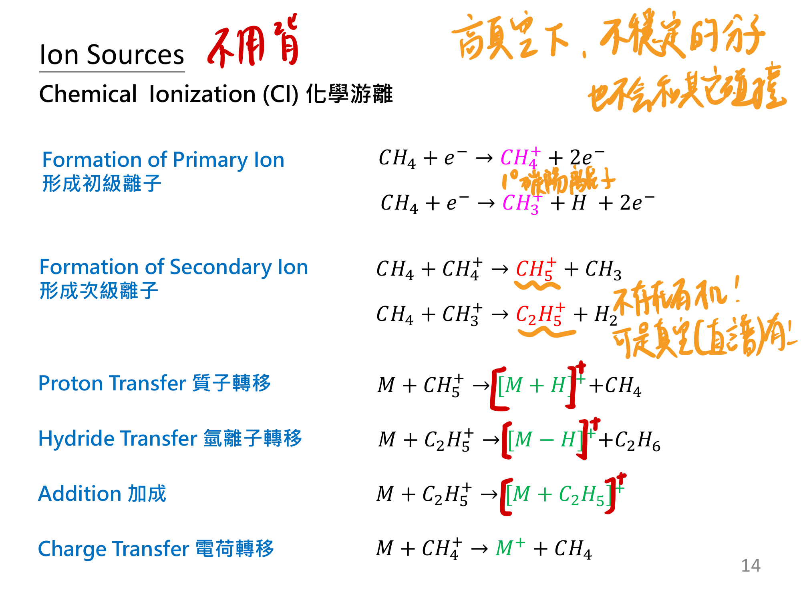

CI 的游離過程分兩步：

**第一步：初級離子產生**
CH₄ + e⁻ → CH₄⁺• + 2e⁻

**第二步：次級離子產生**
CH₄⁺• + CH₄ → CH₅⁺ + CH₃•

然後次級離子跟樣品分子（M）作用，有四種方式：

1. **質子轉移**：CH₅⁺ + M → MH⁺ + CH₄（最常見！）
2. **加成**：CH₅⁺ + M → [M+CH₅]⁺
3. **氫離子轉移**：CH₅⁺ + M → [M-H]⁺ + CH₆
4. **電荷轉移**：CH₄⁺• + M → M⁺• + CH₄

🔑 **重點提示**：質子轉移最常考！樣品會變成 **[M+H]⁺**（不是 M⁺•），所以 CI 的分子離子峰出現在 M+1 的位置。

---

## Page 15: CI 質子親和力表

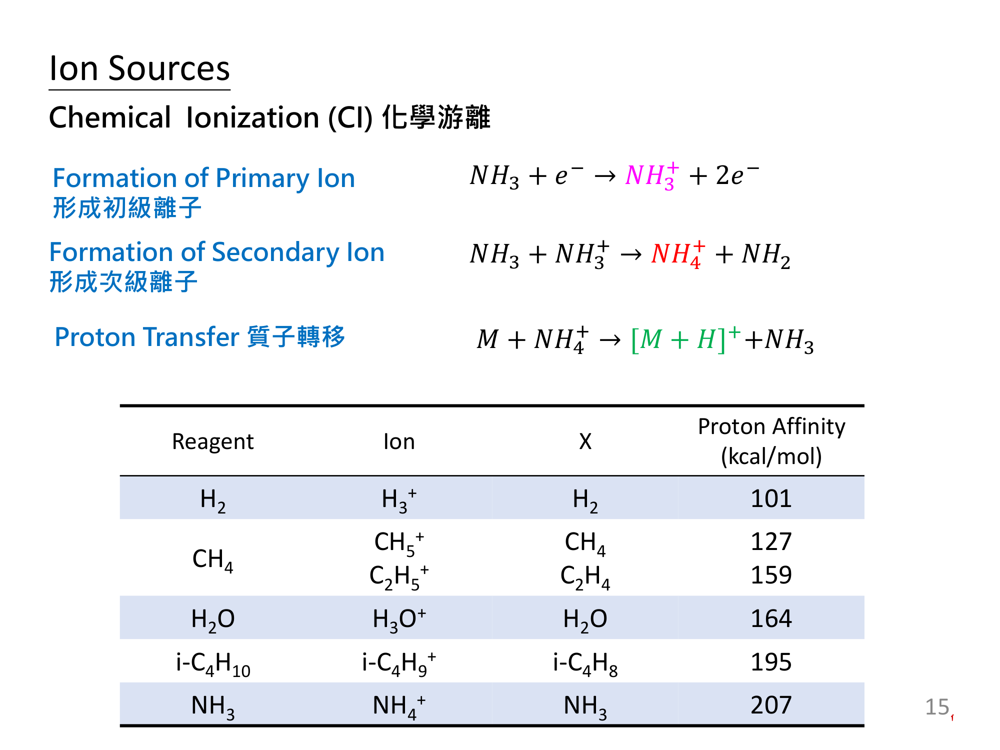

質子親和力（Proton Affinity）決定了哪個分子比較會「搶」質子：

| 分子 | 質子親和力 (kJ/mol) |
|------|---------------------|
| H₂ | 101 |
| CH₄ | 127 |
| C₂H₆ | 159 |
| H₂O | 164 |
| i-C₄H₁₀ | 195 |
| NH₃ | 207 |

**重點邏輯**：質子親和力越大的分子，越容易當試劑氣體，因為它搶到質子後不容易還回去。

**NH₃ 親和力最高（207）**，所以 NH₃ 常被用作 CI 的試劑氣體，給出質子的能力最溫和。

🧠 **記憶口訣**：**氨最搶質子（207）> 異丁烷 > 水 > 乙烷 > 甲烷 > 氫氣**。

---

## Page 16: FAB 快速原子撞擊（Fast Atom Bombardment）

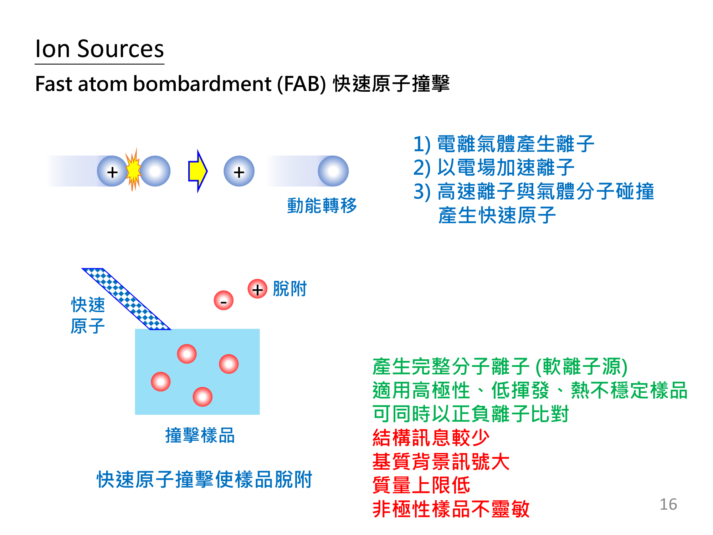

**FAB 是軟離子源**：

原理：
1. 先用電場加速離子（如 Ar⁺ 或 Xe⁺）
2. 加速後的離子撞擊中性氣體原子，**交換電荷**，產生**快速中性原子**
3. 快速中性原子撞擊樣品表面，使分子**脫附（desorb）**並游離

特點：
- 適合極性大、熱不穩定的分子（如胜肽、醣類）
- 樣品通常溶在甘油基質（glycerol matrix）中
- 會產生 [M+H]⁺ 或 [M+Na]⁺ 等加成物

🧠 **記憶口訣**：FAB = **快原子撞表面**，軟、溫和、適合大分子。

---

## Page 17: MALDI 基質輔助雷射脫附游離

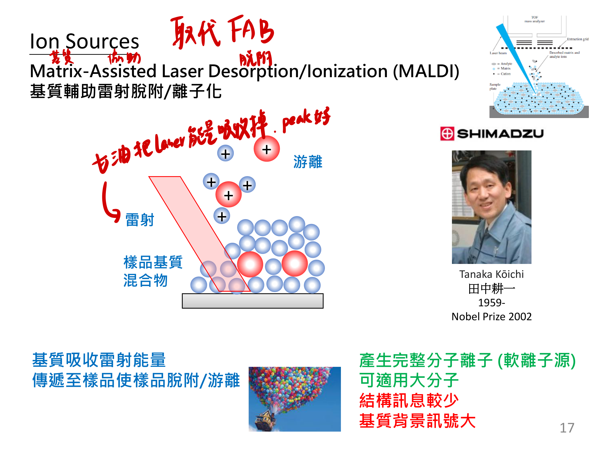

**MALDI（Matrix-Assisted Laser Desorption/Ionization）** 是軟離子源：

原理：
1. 樣品和**基質（matrix）**混合後點在靶板上
2. 雷射照射，**基質先吸收雷射能量**
3. 基質把能量傳遞給樣品分子
4. 樣品分子脫附並游離

**田中耕一** 因為發展 MALDI 相關技術，獲得 **2002 年諾貝爾化學獎**。

🔑 **重點提示**：MALDI = 基質幫忙吸能量，樣品被「溫柔地」推出去。田中耕一 + Fenn 同年得獎。

---

## Page 18: MALDI 基質三要件

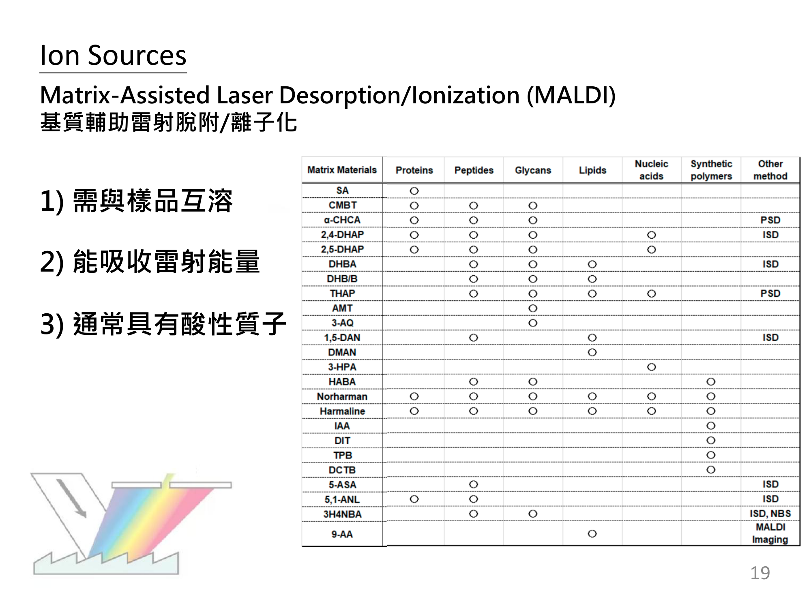

MALDI 的基質不是隨便選的，必須滿足三個條件：

1. **需與樣品互溶**：基質要能把樣品均勻分散，不能分層
2. **能吸收雷射能量**：基質在雷射波長處要有強吸收（通常是 UV 區域）
3. **通常具有酸性質子**：方便提供質子給樣品，形成 [M+H]⁺

常見基質：CHCA、DHB、SA 等（考試不會考太細，知道這三個就好）

🧠 **記憶口訣**：**溶、吸、酸**——互溶、吸雷射、酸性質子。

---

## Page 19: ESI 電灑游離（Electrospray Ionization）

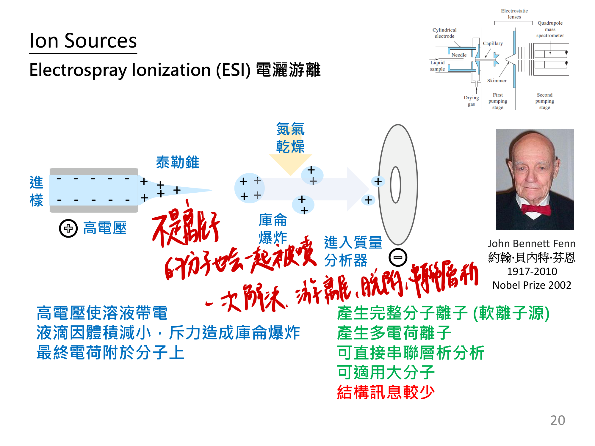

**ESI 是最常用的軟離子源之一**，特別適合大分子（蛋白質、胜肽）：

原理：
1. 樣品溶液從毛細管噴出，施加**高電壓**
2. 形成**帶電液滴**
3. 溶劑蒸發，液滴縮小
4. 電荷密度過高 → **庫侖爆炸（Coulomb explosion）**
5. 液滴碎裂成更小的帶電液滴
6. 最終形成**多電荷離子**（如 [M+nH]ⁿ⁺）

**Fenn** 因為發展 ESI，獲得 **2002 年諾貝爾化學獎**（跟田中耕一同一年）。

🔑 **重點提示**：ESI 的特色是**多電荷**！一個大分子可以帶很多個 H⁺，所以 m/z 值可以落在儀器範圍內，即使分子量很大。

🧠 **記憶口訣**：ESI = **電灑→庫侖爆炸→多電荷**，大分子的好朋友。

---

## Page 20: DESI 脫附電灑游離

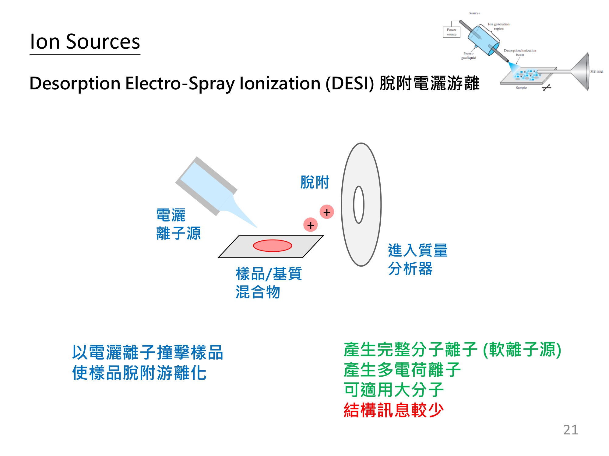

**DESI（Desorption Electrospray Ionization）**：

原理：
- 把 ESI 產生的帶電液滴噴向固體樣品表面
- 樣品表面的分子被撞擊後脫附並游離
- **不需要前處理**！直接把溶劑噴向樣品就能分析

特點：
- 環境游離（Ambient Ionization）的代表
- 可以分析固體表面上的物質
- 不用製備樣品，很快很方便
- 常用於現場快速檢測（毒品、炸藥、食品添加物等）

🔑 **重點提示**：DESI 的賣點是**免前處理**，直接噴就能測。

---

## Page 21: EI 應用 — 1-pentanol

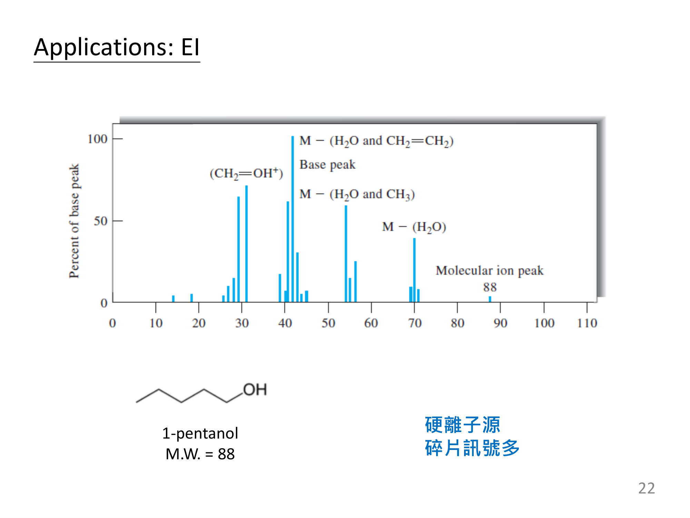

用 EI 打 **1-pentanol（MW = 88）**：

因為 EI 是硬離子源，1-pentanol 被打得很碎，質譜圖上會看到很多碎片峰：
- M⁺• 峰（m/z = 88）可能很弱
- 各種碎片峰很強

醇類在 EI 下的特徵：
- **脫水**：失去 H₂O（18），[M-18]⁺
- **α 斷裂**：C-C 鍵斷裂產生 m/z = 31（CH₂OH⁺）
- **脫氫**：[M-1]⁺（短鏈醇）

🔑 **重點提示**：醇類用 EI，碎片多、分子離子弱，這就是硬離子源的特徵。

---

## Page 22: EI vs CI 比較

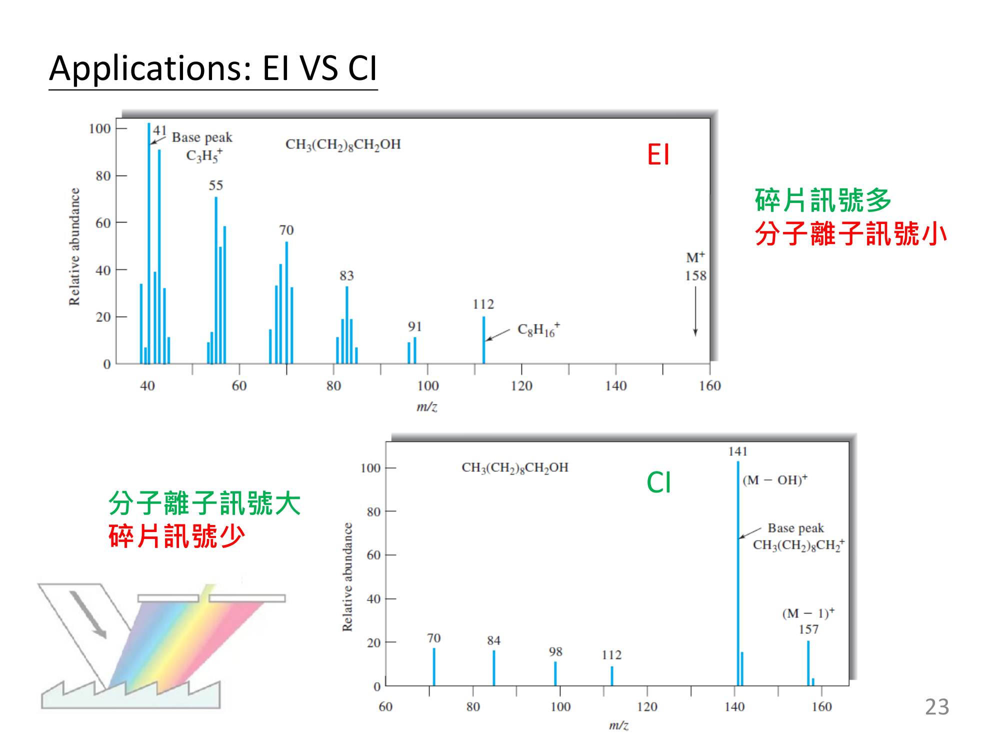

這頁直接比較兩種最常見的離子源：

| | EI | CI |
|---|---|---|
| 能量 | 高（70 eV） | 低（間接游離） |
| 碎片 | 多 | 少 |
| 分子離子峰 | 弱或消失 | 強（[M+H]⁺） |
| 結構資訊 | 豐富 | 較少 |
| 分子量判斷 | 難 | 容易 |

**結論**：EI 和 CI 是互補的！EI 給你結構，CI 給你分子量。實務上常常兩個都跑，互相驗證。

🧠 **記憶口訣**：**EI 碎結構，CI 整分子**。

---

## Page 23: ESI 應用 — 多電荷大分子

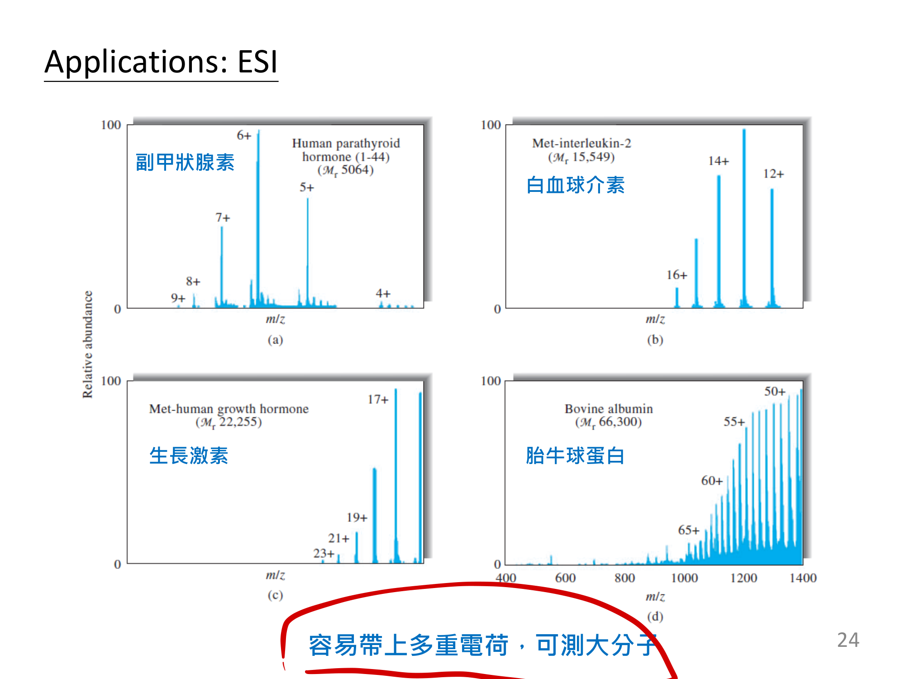

ESI 最大的優勢：**多電荷離子讓大分子也能測**！

例子：
- 副甲狀腺素（Parathyroid Hormone, PTH）
- 白血球介素（Interleukin）

一個分子量 10,000 Da 的蛋白質：
- 如果帶 10 個電荷，m/z ≈ (10000+10)/10 = 1001
- 如果帶 20 個電荷，m/z ≈ (10000+20)/20 = 501

這些 m/z 值都在一般質譜儀的範圍內！所以 ESI 可以測到幾萬甚至幾十萬 Da 的分子。

🔑 **重點提示**：ESI 的多電荷特性讓大分子分析成為可能，這是它跟其他離子源最大的不同。

---

## Page 24: MALDI 應用

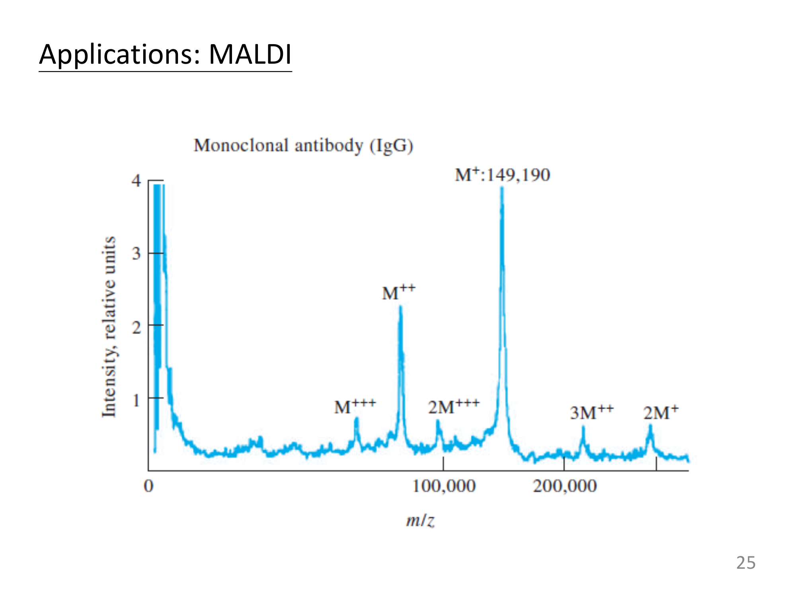

MALDI 的應用場景：
- **蛋白質體學**：大分子蛋白質的分析
- **胜肽質譜**：蛋白質消化後的胜肽指紋
- **聚合物分析**：高分子量聚合物的分布
- **醣類分析**：寡醣和多醣

MALDI 的優勢：
- 單電荷為主（[M+H]⁺），質譜圖比較好讀
- 適合大分子（可達數十萬 Da）
- 圖譜相對簡單（碎片少）

🔑 **重點提示**：MALDI = 大分子 + 單電荷 + 圖譜簡單。跟 ESI 比起來，MALDI 的圖更好讀，但沒有 LC 分離能力。

---

## Page 25: 地圖（加油提示）

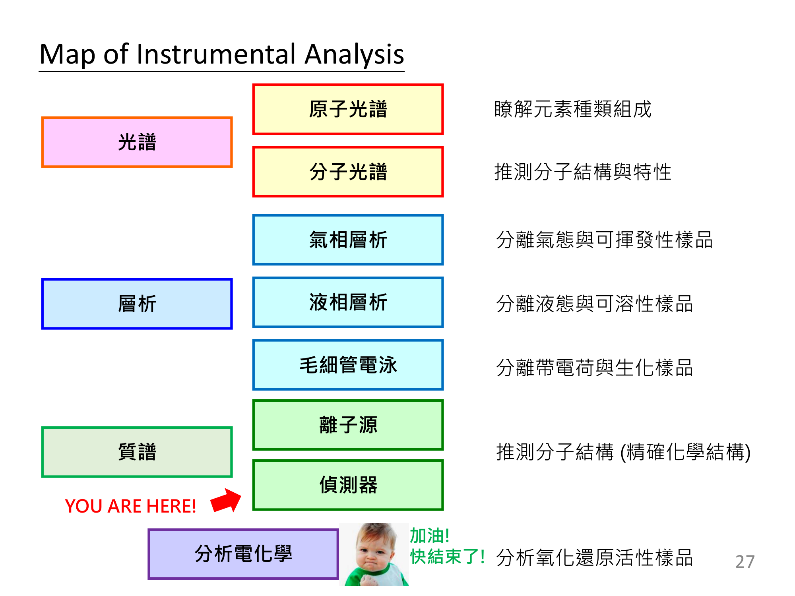

這頁是複習地圖的中場休息，提醒你已經學完離子源的部分，接下來要進入**質量分析器**了。

上半場（離子源）回顧：
- EI（硬）→ CI（軟）→ FAB → MALDI → ESI → DESI

下半場（質量分析器）預告：
- 磁扇區 → 四極柱 → 離子阱 → TOF

加油！過一半了 💪

---

## Page 26: 磁扇區分析儀

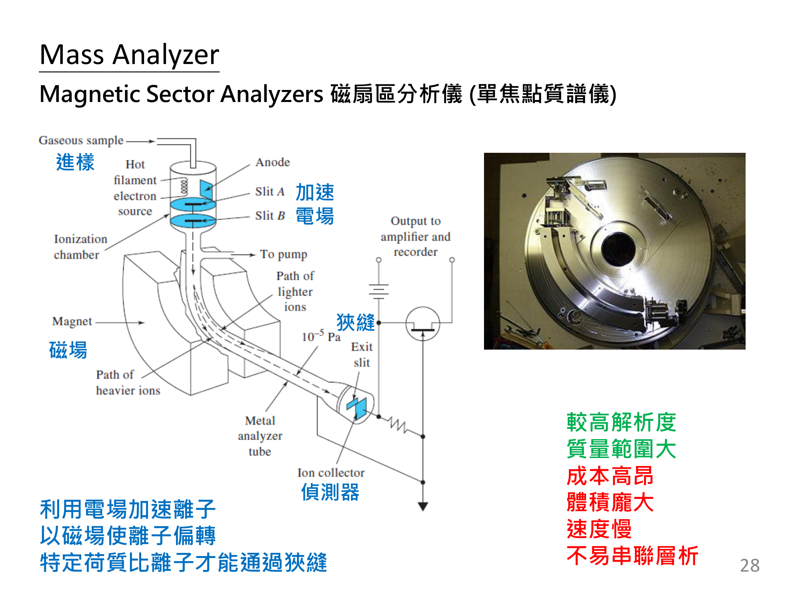

**磁扇區（Magnetic Sector）** 是最早的質量分析器：

原理：
1. 離子被電場加速
2. 進入磁場，受到**勞侖兹力**偏轉
3. 不同 m/z 的離子偏轉半徑不同
4. 通過狹縫被偵測器接收

**優點**：
- 高解析度
- 質量範圍大

**缺點**：
- 昂貴
- 體積大
- 掃描速度慢
- 不容易串聯（MS/MS）

🔑 **重點提示**：磁扇區 = 老牌但高解析，貴但準。

---

## Page 27: 磁扇區推導 — 磁力 = 離心力

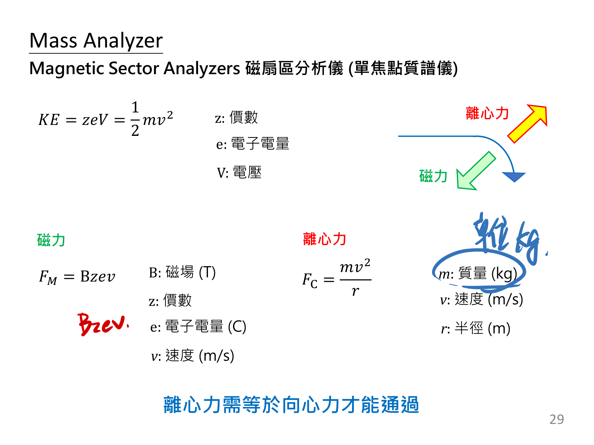

這是磁扇區的核心推導，從物理出發：

離子在磁場中做圓周運動，此時：
- **磁力（向心力）**：FM = Bzev
  - B = 磁場強度
  - z = 離子電荷數
  - e = 基本電荷
  - v = 離子速度
- **離心力**：FC = mv²/r
  - m = 離子質量
  - v = 離子速度
  - r = 偏轉半徑

當磁力 = 離心力（穩定圓周運動）：
**Bzev = mv²/r**

🔑 **重點提示**：這個等式是整個磁扇區推導的起點，FM = FC 是關鍵。

---

## Page 28: 磁扇區推導完成

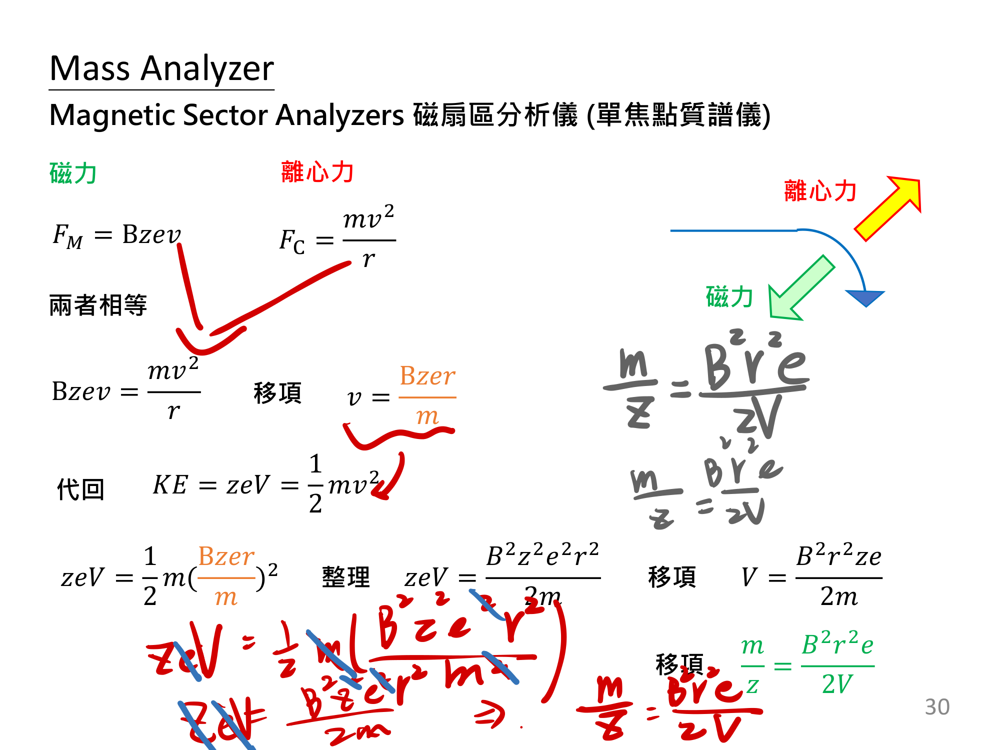

從 FM = FC 出發：

Bzev = mv²/r

整理後得到兩個重要公式：

**公式 1**：m/z = B²r²e / 2V
- 這告訴我們：在固定 B 和 V 的情況下，不同 m/z 的離子有不同的偏轉半徑 r

**公式 2**：V = B²r²ze / 2m
- 這告訴我們：在固定 B 和 r 的情況下，改變加速電壓 V 就能掃描不同的 m/z

🧠 **記憶口訣**：**磁扇區公式背 m/z = B²r²e/2V**，考試推導可能要寫出來。

推導過程：
1. Bzev = mv²/r
2. v = √(2zeV/m)（從 KE = zeV = ½mv² 得到）
3. 代入整理 → m/z = B²r²e/2V

---

## Page 29: Example 20-4 — H₂O 的磁扇區計算

題目：計算 H₂O⁺ 在磁扇區中的加速電壓

已知：
- m(H₂O⁺) = 18.0106 amu = 18.0106 × 1.6605 × 10⁻²⁷ kg
- B = 0.240 T
- r = 12.7 cm = 0.127 m
- z = 1

代入公式：V = B²r²ze / 2m

計算結果：**V = 2.49 × 10³ V**

🔑 **重點提示**：這類計算題要把單位統一（amu → kg, cm → m），然後代入公式就行。

---

## Page 30: 四極柱 m/z 篩選示意圖

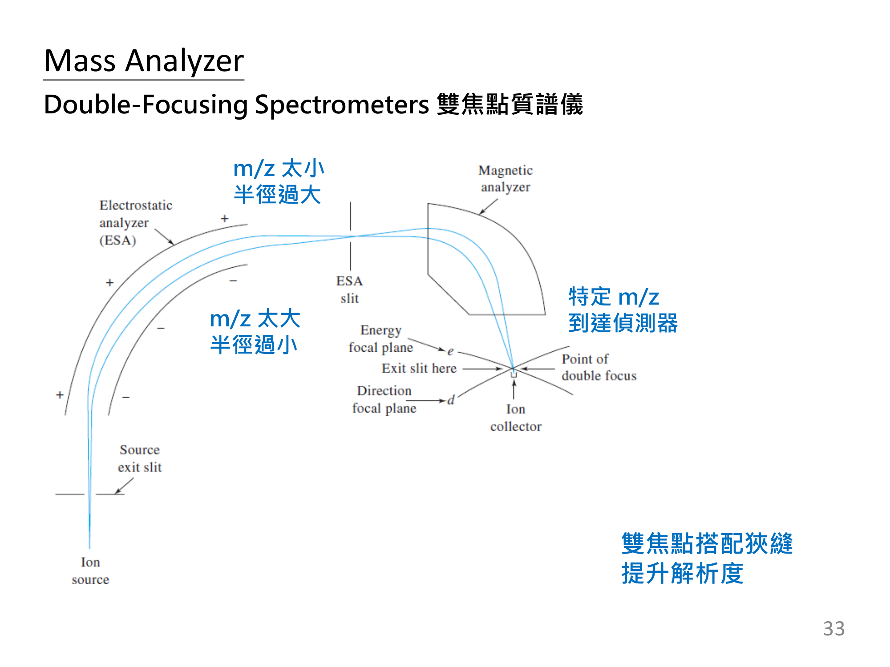

這頁是四極柱的示意圖，展示四根平行的金屬桿：

- 兩對電極（x 方向一對，y 方向一對）
- 施加 DC + RF（射頻）的混合電壓
- 只有特定 m/z 的離子能穩定通過，到達偵測器
- 其他 m/z 的離子會不穩定震盪，撞到極柱被消滅

四極柱就像一個**質量篩選器**，通過調整 DC 和 RF 的比值，可以選擇讓哪個 m/z 通過。

🔑 **重點提示**：四極柱 = 質量濾波器（mass filter），一次只讓一個 m/z 通過。

---

## Page 31: 雙焦點質譜儀

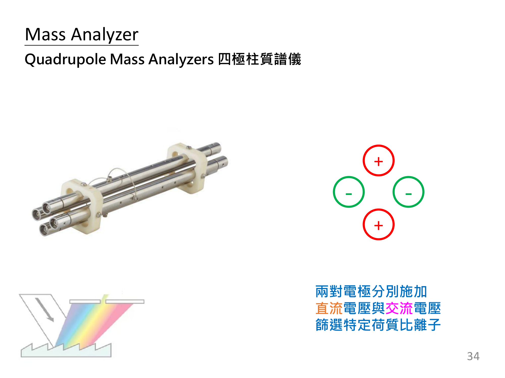

**雙焦點（Double Focusing）質譜儀**：

在磁扇區前面加一個 **ESA（Electrostatic Analyzer，靜電分析器）**：

1. ESA 先用電場做**能量聚焦**（把動能相近的離子聚在一起）
2. 磁場再做**方向聚焦**（把 m/z 相同的離子聚在一起）
3. 搭配狹縫，大幅提升解析度

**單焦點**：只有磁場 → 只做方向聚焦
**雙焦點**：ESA + 磁場 → 能量 + 方向都聚焦

🔑 **重點提示**：雙焦點 = ESA + 磁場 + 狹縫 = 高解析。考試可能會問「雙焦點比單焦點多了什麼？」答案是 ESA（能量聚焦）。

---

## Page 32: 四極柱原理 — DC + RF

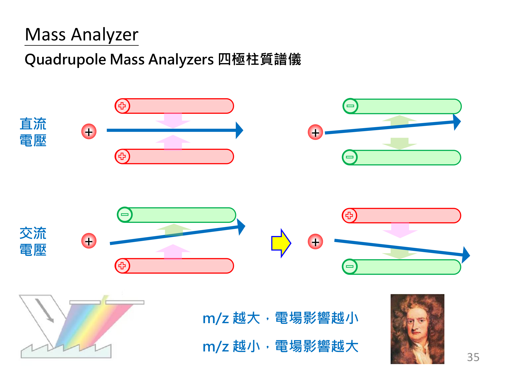

四極柱由四根平行金屬桿組成：

- **兩對電極**：一對在 x 方向，一對在 y 方向
- 每對施加 **DC（直流）+ RF（射頻交流）** 的混合電壓
- DC 和 RF 的比值決定了哪個 m/z 能穩定通過

數學上，離子在四極柱中的運動可以用 **Mathieu 方程式** 描述（但考試不會叫你解，知道就好）。

🔑 **重點提示**：DC + RF 的比值是四極柱的「旋鈕」，調這個比值就能選擇通過的 m/z。

---

## Page 33: 四極柱 — m/z 剛好（穩定通過）

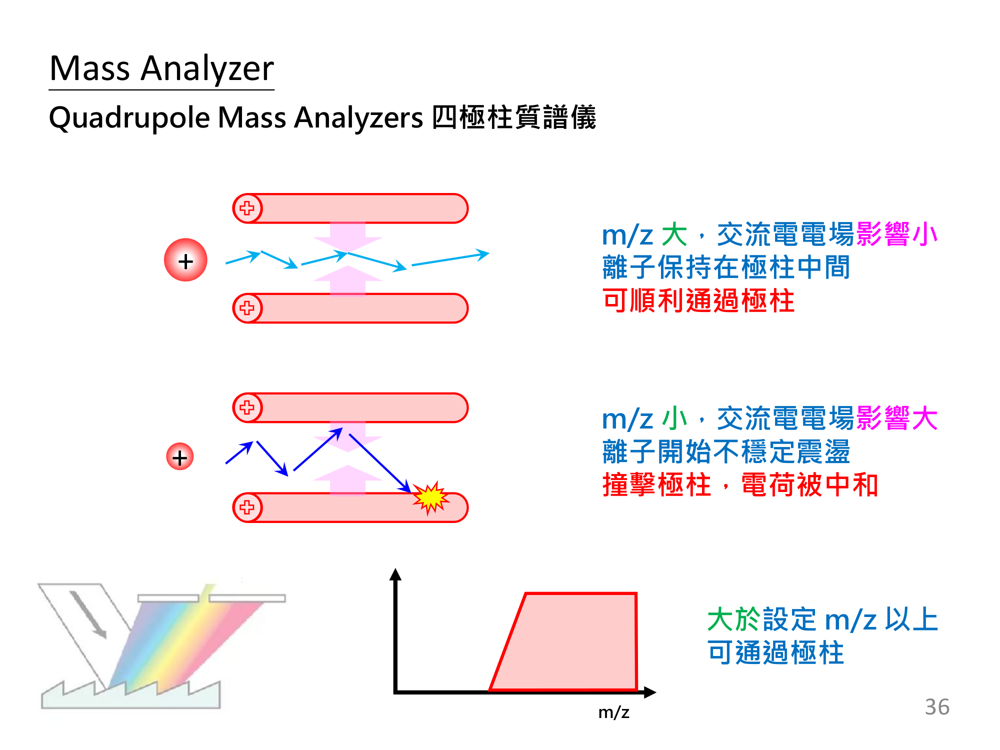

**m/z 剛好（在篩選範圍內）**：

- 交流電（RF）的影響適中
- 離子在 x 和 y 方向的震盪幅度被控制住
- 離子保持在中間附近，不會撞到極柱
- **穩定通過** → 到達偵測器 → 產生訊號

這就是四極柱的篩選原理：只有 m/z 在設定範圍內的離子能穩定通過。

---

## Page 34: 四極柱 — m/z 太小（不穩定）

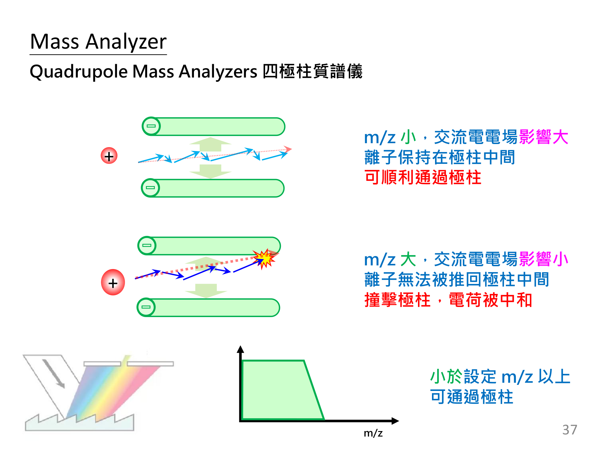

**m/z 太小**：

- 交流電對輕離子的影響很大
- 離子震盪幅度越來越大（不穩定）
- 最終撞到極柱 → 被消滅 → 無法到達偵測器

所以太輕的離子通不過四極柱。

🔑 **重點提示**：m/z 太小 → RF 影響大 → 震盪不穩定 → 撞極柱。

---

## Page 35: 四極柱 — m/z 太大（也通不過）

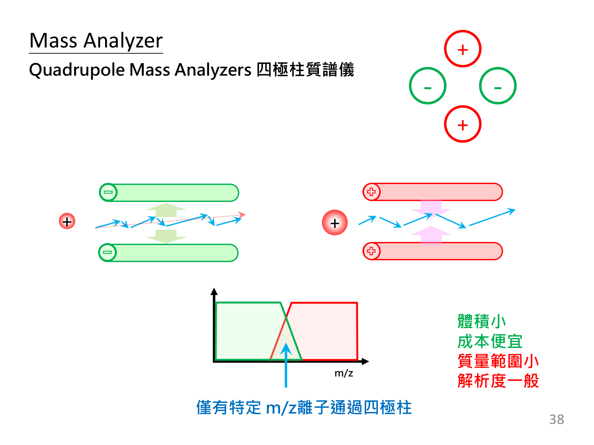

**m/z 太大**：

- 交流電對重離子的影響太小
- DC 電場把離子推向極柱方向
- 交流電推不回來（力量不夠）
- 離子無法被推回中心 → 撞到極柱 → 被消滅

所以太重的離子也通不過四極柱。

🔑 **重點提示**：m/z 太大 → DC 主導 → 推向外側 → RF 推不回來 → 撞極柱。四極柱只能讓「剛好」的 m/z 通過。

---

## Page 36: 四極柱總結

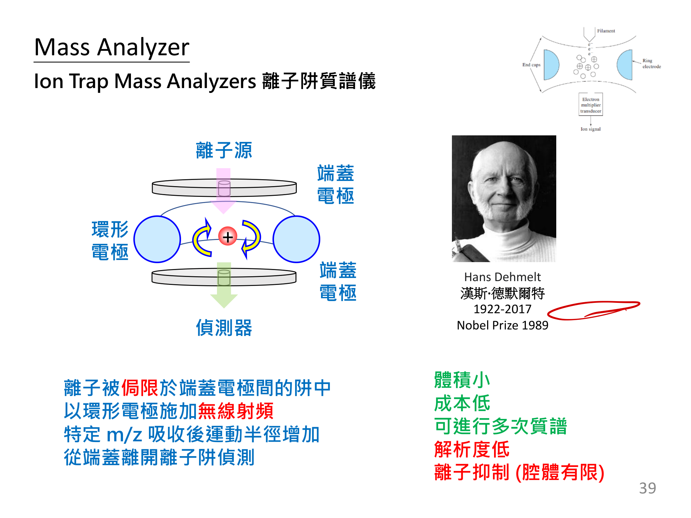

**四極柱的篩選機制**：
- m/z 太小 → 震盪不穩定 → 撞極柱
- m/z 剛好 → 穩定通過 → 到達偵測器
- m/z 太大 → 推向外側 → 撞極柱

**優點**：
- 體積小
- 價格便宜
- 掃描速度快

**缺點**：
- 質量範圍較小（通常 m/z 上限約 2000-4000）
- 解析度一般（單位質量解析）

🧠 **記憶口訣**：四極柱 = **小便宜快**（小、便宜、掃描快），但**範圍小、解析一般**。

---

## Page 37: 離子阱（Ion Trap）

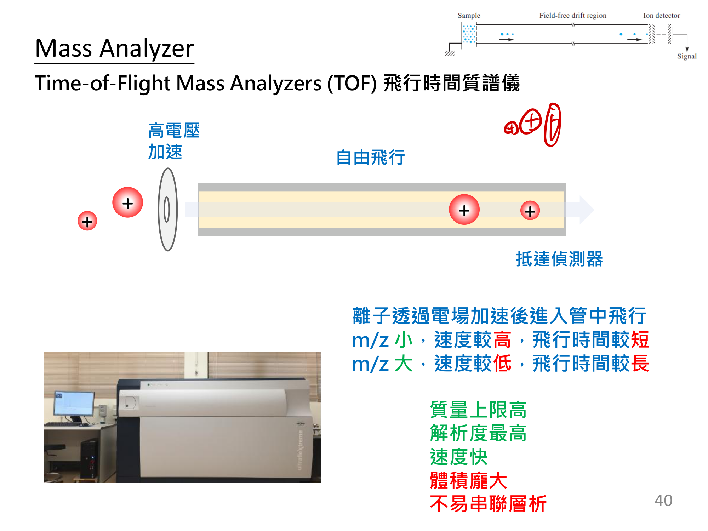

**離子阱（Ion Trap）**：

構造：
- **端蓋電極（End Cap）**：上下兩片
- **環形電極（Ring Electrode）**：中間環狀
- 施加 **RF 電壓**

原理：
- 離子被困在電極之間的空間中「旋轉」
- 調整 RF 頻率/振幅，可以依序把不同 m/z 的離子「甩出」去
- 被甩出的離子到達偵測器產生訊號

**Dehmelt** 因為離子阱技術獲得 **1989 年諾貝爾物理獎**。

優點：
- 體積小
- 可以做 MSⁿ（多次碎裂）
- 靈敏度高

🔑 **重點提示**：離子阱 = 關住離子再依序釋放。能做 MSⁿ 是它最大的特色。

---

## Page 38: TOF 飛行時間分析器（Time of Flight）

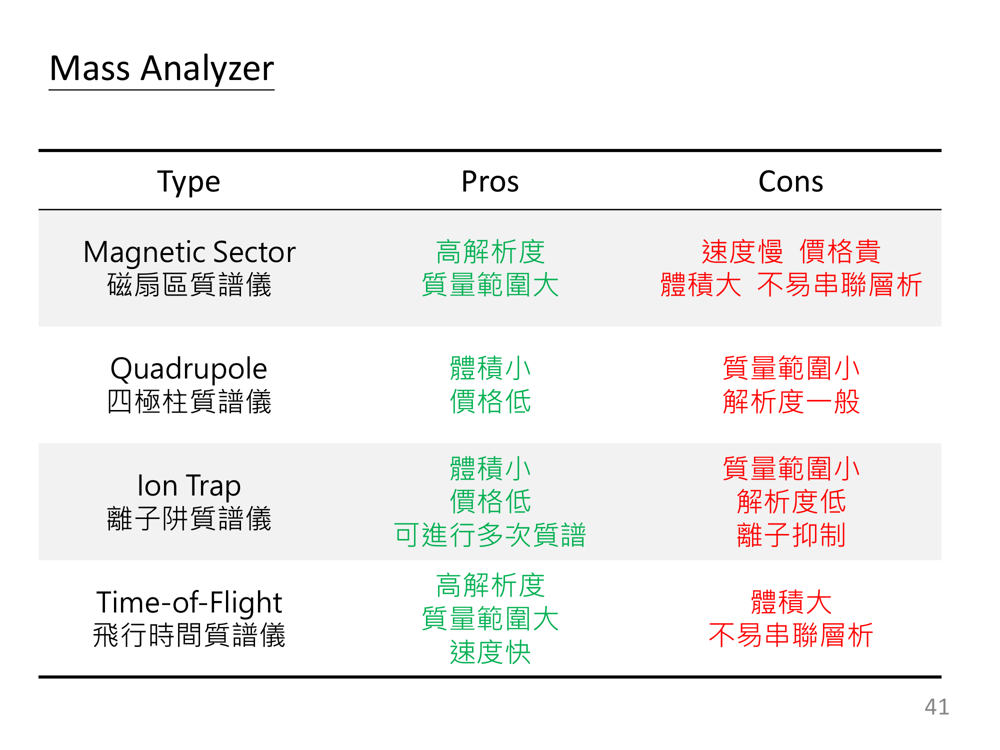

**TOF（飛行時間）** 的原理最直觀：

1. 離子被電場加速 → 獲得相同的動能
2. 進入**無場飄移管**（自由飛行區域）
3. 輕的離子飛得快，重的離子飛得慢
4. 測量到達偵測器的時間 → 反推 m/z

公式概念：
- KE = ½mv² = zeV
- v = √(2zeV/m)
- t = L/v（L 是飛行管長度）
- 所以 m/z ∝ t²

**優點**：
- 解析度高（特別是反射型 TOF）
- 質量範圍大（理論上無上限）
- 掃描速度極快

**缺點**：
- 體積大時不易串聯（MS/MS）

🧠 **記憶口訣**：TOF = **輕快重慢**，飛行時間跟 m/z 成正比（的平方）。

---

## Page 39: 分析器比較表

四大質量分析器比較：

| | 磁扇區 | 四極柱 | 離子阱 | TOF |
|---|---|---|---|---|
| 解析度 | 高 | 一般 | 一般 | 高 |
| 質量範圍 | 大 | 小 | 小 | 極大 |
| 掃描速度 | 慢 | 快 | 快 | 極快 |
| 價格 | 貴 | 便宜 | 便宜 | 中等 |
| 體積 | 大 | 小 | 小 | 大 |
| MS/MS | 不易 | 可（三重四極） | MSⁿ | 有限 |

🧠 **記憶口訣**：**磁扇區高準貴大，四極柱小便宜快，離子阱MSⁿ小，TOF大範圍超快**。

---

## Page 40: 正負離子模式

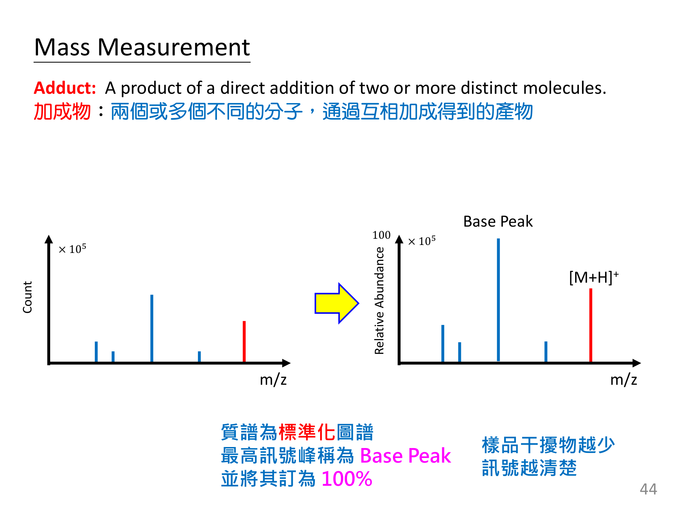

質譜可以選擇偵測**正離子**或**負離子**：

**正離子模式**：偵測 [M+H]⁺、[M+Na]⁺ 等
**負離子模式**：偵測 [M-H]⁻ 等

重要：**同一次分析只能選一種模式**，不能同時偵測正負離子。

什麼時候用哪個？
- 大部分有機化合物用**正離子模式**（加 H⁺ 或 Na⁺）
- 酸性化合物、含鹵素化合物有時用**負離子模式**
- 實務上常常兩個都跑，看哪個訊號好

🔑 **重點提示**：正負離子模式一次只能選一個！

---

## Page 41: 基峰與加成物

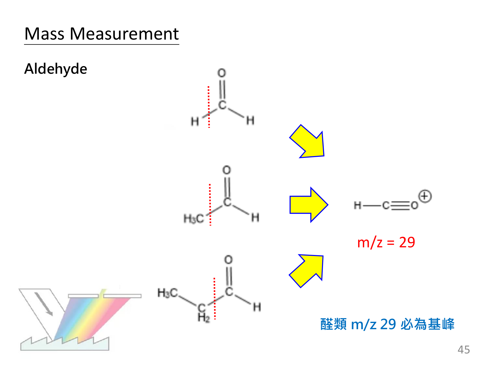

**基峰（Base Peak）**：
- 質譜圖中訊號最強的峰
- 將其強度設為 **100%**
- 其他峰的相對強度都以基峰為基準計算

**加成物（Adduct）**：
- 分子離子除了 [M+H]⁺ 之外，可能還會抓到其他東西
- 常見加成物：
  - [M+Na]⁺（鈉加成物，很常見！）
  - [M+K]⁺（鉀加成物）
  - [M+H-H₂O]⁺（脫水加成物）

🔑 **重點提示**：基峰 ≠ 分子離子峰！基峰是最強的峰，可能是碎片峰。分子離子峰是 M⁺• 或 [M+H]⁺。

---

## Page 42: 醛類 — m/z = 29 必為基峰

**醛類的質譜特徵**：

醛類（R-CHO）在 EI 下有一個非常顯著的特徵：
- **m/z = 29（CHO⁺）必為基峰**

為什麼？因為醛的 -CHO 基團非常容易斷裂產生 CHO⁺，而且這個碎片很穩定。

不管是哪種醛（乙醛、丙醛、丁醛...），m/z = 29 的峰一定是最強的。

🧠 **記憶口訣**：**醛類 29 必基峰**，看到 m/z=29 是基峰就想到醛。

---

## Page 43: 醛類碎片

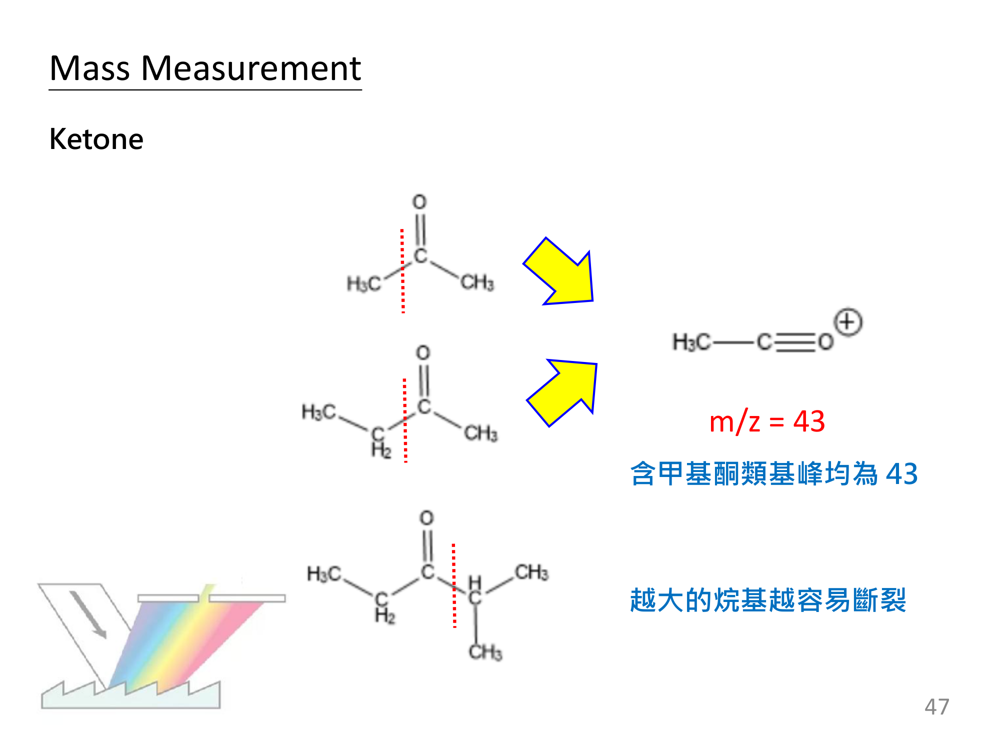

醛類的主要碎片：

1. **[M-29]⁺**：失去 CHO 基團（m/z = 29），剩下 R⁺
2. **[M-15]⁺**：失去甲基 CH₃（m/z = 15）

判斷技巧：
- 如果質譜圖中 m/z = 29 是基峰
- 且有 [M-29]⁺ 和 [M-15]⁺ 的碎片
- 大概率是醛類

🔑 **重點提示**：醛類的碎片模式很規律——29 是基峰，M-29 和 M-15 是特徵碎片。

---

## Page 44: 酮類 — 甲基酮基峰 m/z = 43

**酮類的質譜特徵**：

甲基酮（CH₃-CO-R）在 EI 下：
- **基峰 m/z = 43（CH₃CO⁺，乙醯基離子）**

α 斷裂的規律：
- **越大的烷基越容易斷**（因為斷裂後形成的碳正離子越穩定）
- 所以酮的兩側，大烷基那邊比較容易斷

例如 2-butanone（CH₃COCH₂CH₃）：
- CH₃CO⁺ → m/z = 43（基峰）
- CH₃CH₂⁺ → m/z = 29

🧠 **記憶口訣**：**酮類 43 必基峰**，越大烷基越易斷。

---

## Page 45: 酮類碎片

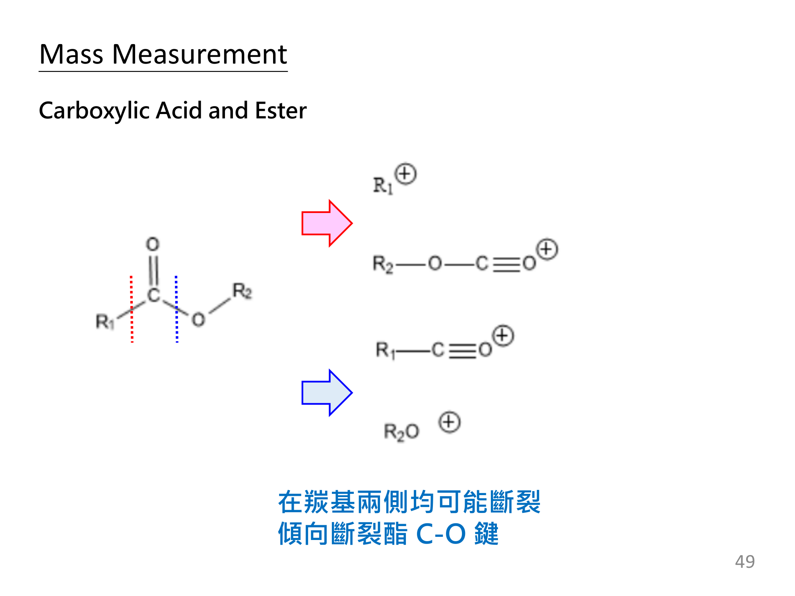

酮類的主要碎片：

1. **[M-15]⁺**：失去甲基 CH₃
2. **[M-29]⁺**：失去乙基 C₂H₅

α 斷裂規律（背起來！）：
- 羰基（C=O）兩側的 α 鍵都可能斷裂
- 斷哪一邊取決於哪邊的烷基更大
- 越大的烷基越容易斷（形成的碳正離子越穩定）

🔑 **重點提示**：酮類 α 斷裂是大烷基先斷，碎片 m/z = 43 是乙醯基離子的標誌。

---

## Page 46: 羧酸與酯 — 羰基兩側斷裂

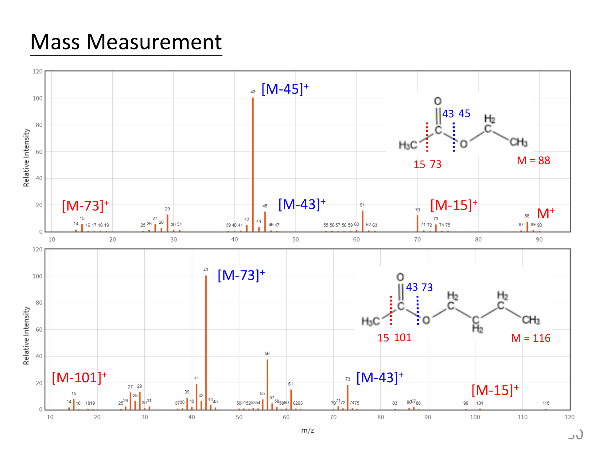

**羧酸與酯的質譜特徵**：

羧酸（R-COOH）和酯（R-COOR'）的羰基兩側都可能斷裂：

- **醯基側（C=O 這邊）** 斷裂
- **烷氧基側（O-R' 這邊）** 斷裂

但有一個傾向：**酯類傾向斷裂 C-O 鍵（烷氧基側）**

為什麼？因為斷 C-O 鍵後產生的醯基離子（R-CO⁺）很穩定（共振穩定）。

🔑 **重點提示**：羧酸和酯的羰基兩側都可能斷，但酯類偏好斷 C-O 鍵。

---

## Page 47: 羧酸與酯碎片

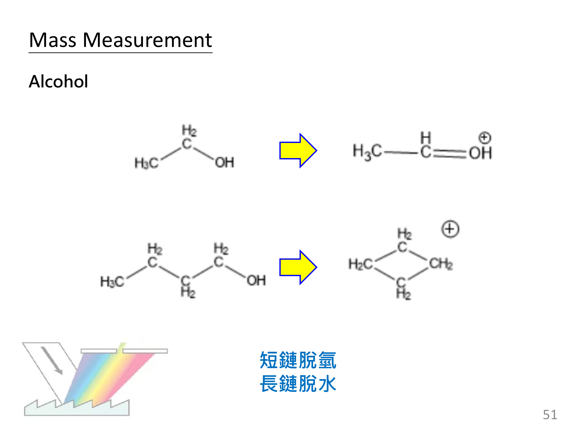

羧酸與酯的特徵碎片：

- **[M-15]⁺**：失去甲基
- **[M-43]⁺**：失去乙醯基（COCH₃ 或 CH₃CO）
- **[M-73]⁺**：失去較大的烷基
- **[M-45]⁺**：失去 COOH 或 OC₂H₅
- **[M-101]⁺**：失去更大的烷氧基

記憶方式：
- 15 = CH₃
- 29 = C₂H₅ 或 CHO
- 43 = C₃H₇ 或 CH₃CO
- 45 = COOH 或 OC₂H₅

🧠 **記憶口訣**：**15甲基29乙，43丙或乙醯，45甲酸或乙氧**。

---

## Page 48: 醇類 — 脫氫與脫水

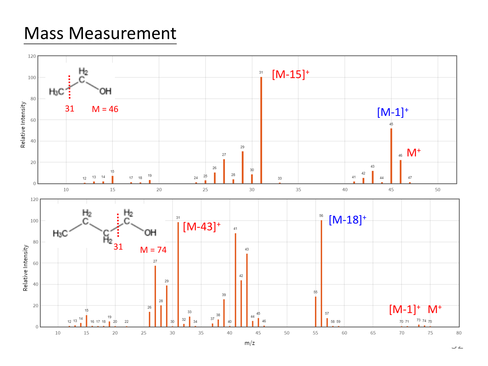

**醇類的質譜特徵**：

1. **短鏈醇**：主要碎片是**脫氫 [M-1]⁺**
   - 失去 α 位置的氫，形成穩定的氧正離子
   
2. **長鏈醇**：主要碎片是**脫水 [M-18]⁺**
   - 失去 H₂O（18），這是醇類最特徵的碎片
   - 因為長鏈醇有夠多的碳可以進行重排脫水

🔑 **重點提示**：
- 短鏈醇看 [M-1]⁺
- 長鏈醇看 [M-18]⁺
- m/z = 18 的缺失是醇的標誌！

🧠 **記憶口訣**：**短醇脫氫(-1)，長醇脫水(-18)**。

---

## Page 49: 醇類碎片 — m/z = 31

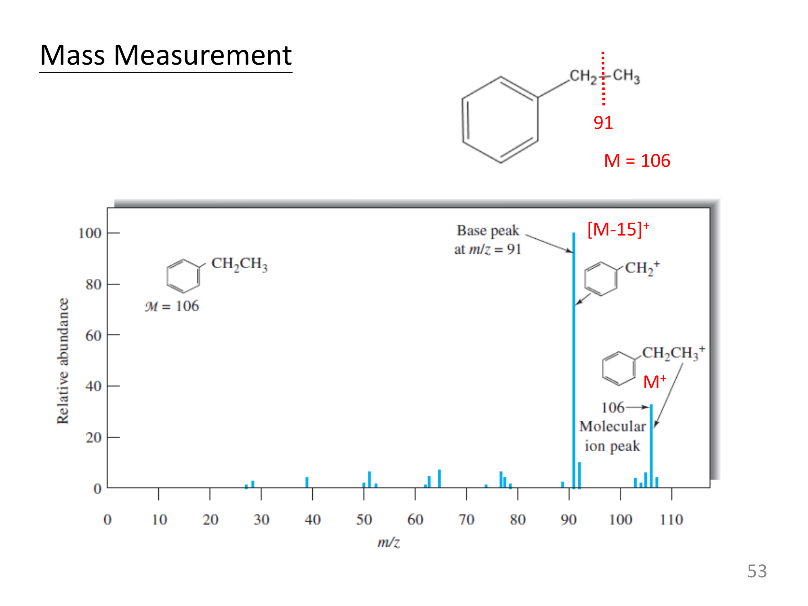

醇類的特徵碎片：

- **m/z = 31（CH₂OH⁺）**

這是醇類 α 斷裂的產物：
- R-CH₂-OH → CH₂OH⁺（m/z = 31）

只要有 -OH 在分子中，α 斷裂就很容易產生 m/z = 31 的碎片。

判斷技巧：
- 質譜圖上有明顯的 m/z = 31
- 加上 [M-18]⁺（脫水）或 [M-1]⁺（脫氫）
- 大概率是醇類

🔑 **重點提示**：m/z = 31 是醇的標誌碎片，跟醛的 29 一樣好認。

---

## Page 50: 芳香族 — m/z = 91 草鎖離子

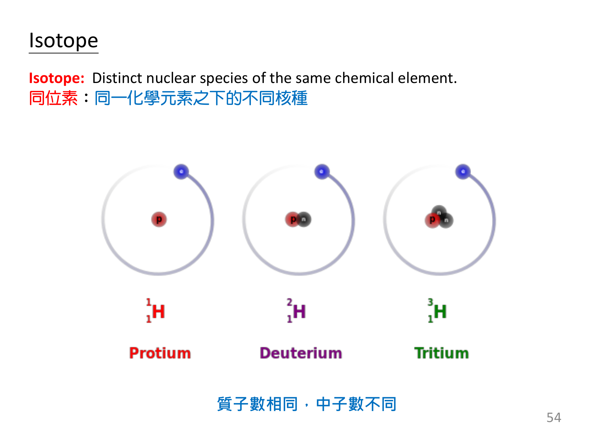

**芳香族的質譜特徵**：

含苯環的化合物在 EI 下常出現 **m/z = 91** 的強峰：

**草鎖離子（Tropylium Ion, C₇H₇⁺）**

形成機制：
- 甲苯（C₆H₅CH₃）先斷掉一個 H 形成 C₇H₇⁺
- 然後環重排形成七元環的穩定結構
- 這個離子非常穩定，所以 m/z = 91 常常是基峰

不管側鏈是什麼（乙基、丙基...），只要有苯環連一個碳，都可能重排成草鎖離子。

🧠 **記憶口訣**：**芳香族 91 草鎖離子**，C₇H₇⁺ 超穩定。

---

## Page 51: 同位素定義

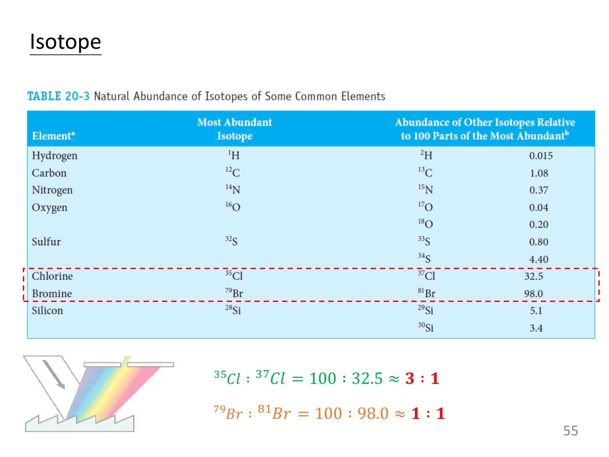

**同位素（Isotope）**：

- 質子數相同（同一元素）
- 中子數不同（質量不同）
- 化學性質幾乎一樣，但質譜可以區分！

例如：
- ¹²C 和 ¹³C（碳的兩個同位素）
- ¹H 和 ²H（氫和氘）
- ³⁵Cl 和 ³⁷Cl（氯的兩個同位素）

同位素在質譜上會產生**同位素峰（Isotope Peak）**，這是判斷分子中含哪些元素的重要線索。

🔑 **重點提示**：質譜能分辨同位素是它的一大優勢，這是 NMR 和 IR 做不到的。

---

## Page 52: Cl 和 Br 的同位素比例

**氯（Cl）和溴（Br）是質譜同位素最常考的兩個元素！**

**氯**：
- ³⁵Cl：自然豐度 75.77%
- ³⁷Cl：自然豐度 24.23%
- 比例 ≈ **3 : 1**

**溴**：
- ⁷⁹Br：自然豐度 50.69%
- ⁸¹Br：自然豐度 49.31%
- 比例 ≈ **1 : 1**

這兩個元素的同位素峰非常明顯：
- 含一個 Cl → M 和 M+2 峰比例約 3:1
- 含一個 Br → M 和 M+2 峰比例約 1:1

🧠 **記憶口訣**：**Cl 三比一，Br 一比一**，看到 M+2 峰就想到鹵素！

---

## Page 53: 同位素峰 — 單一鹵素

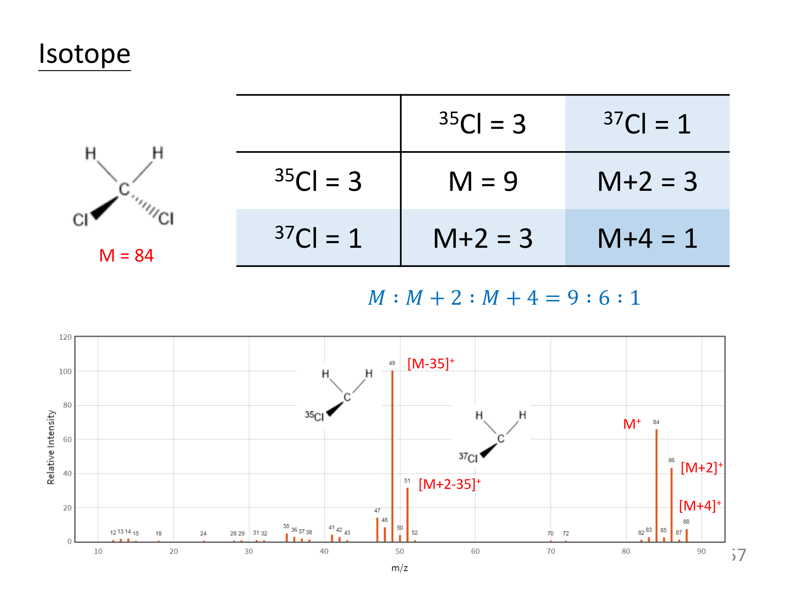

**含一個氯（Cl）**：
- M 峰 : M+2 峰 = **3 : 1**
- 因為 ³⁵Cl 佔 75%，³⁷Cl 佔 25%

**含一個溴（Br）**：
- M 峰 : M+2 峰 ≈ **1 : 1**
- 因為 ⁷⁹Br 和 ⁸¹Br 各約 50%

判斷技巧：
- 看質譜圖上 M 和 M+2 的比例
- 如果 M+2 大約是 M 的 1/3 → 含一個 Cl
- 如果 M+2 跟 M 差不多大 → 含一個 Br

🔑 **重點提示**：M+2 峰是判斷鹵素的關鍵！Cl 看 3:1，Br 看 1:1。

---

## Page 54: 雙氯同位素

**含兩個氯（Cl₂）**：

同位素峰的比例要用**二項式分布**計算：

M : M+2 : M+4 = **9 : 6 : 1**

推導：
- 兩個 Cl 的組合：³⁵Cl³⁵Cl, ³⁵Cl³⁷Cl, ³⁷Cl³⁷Cl
- 機率：(3/4)² : 2×(3/4)(1/4) : (1/4)²
- = 9/16 : 6/16 : 1/16
- = **9 : 6 : 1**

所以含兩個 Cl 的化合物會在 M、M+2、M+4 位置看到 9:6:1 的峰。

🧠 **記憶口訣**：**雙氯 9:6:1**，就是 (3:1)² 的展開。

---

## Page 55: 解析度（Resolution）

**解析度 R 的定義**：

**R = m̄ / Δm**

- m̄ = 兩個峰的平均 m/z
- Δm = 兩個峰的質量差

解析度越高，越能分辨質量相近的峰。

**低解析質譜**：
- 只能區分整數 m/z（如 m/z = 28 和 29）
- R ≈ 1000-3000

**高解析質譜**：
- 可以區分小數點的差異（如 CO = 27.9949 vs N₂ = 28.0061 vs C₂H₄ = 28.0313）
- R > 10,000，甚至可達 100,000+

🔑 **重點提示**：高解析可以確定分子式，低解析只能確定分子量整數。

---

## Page 56: Example 20-3 — 解析度計算

題目：區分 CO（27.9949）和 N₂（28.0061），需要多少解析度？

計算：
- m̄ = (27.9949 + 28.0061) / 2 = 28.0005
- Δm = 28.0061 - 27.9949 = 0.0112
- R = m̄ / Δm = 28.0005 / 0.0112 ≈ **2500**

但投影片給的數字：
- m̄ = 28.0250（可能是不同題目的數值）
- Δm = 0.0126
- R = 28.0250 / 0.0126 = **2.22 × 10³**

不管數值怎樣，公式就是 **R = m̄ / Δm**。

🔑 **重點提示**：解析度計算題的套路就是給兩個相近的 m/z，算 R = m̄ / Δm。

---

## Page 57: 串聯質譜（MS/MS）

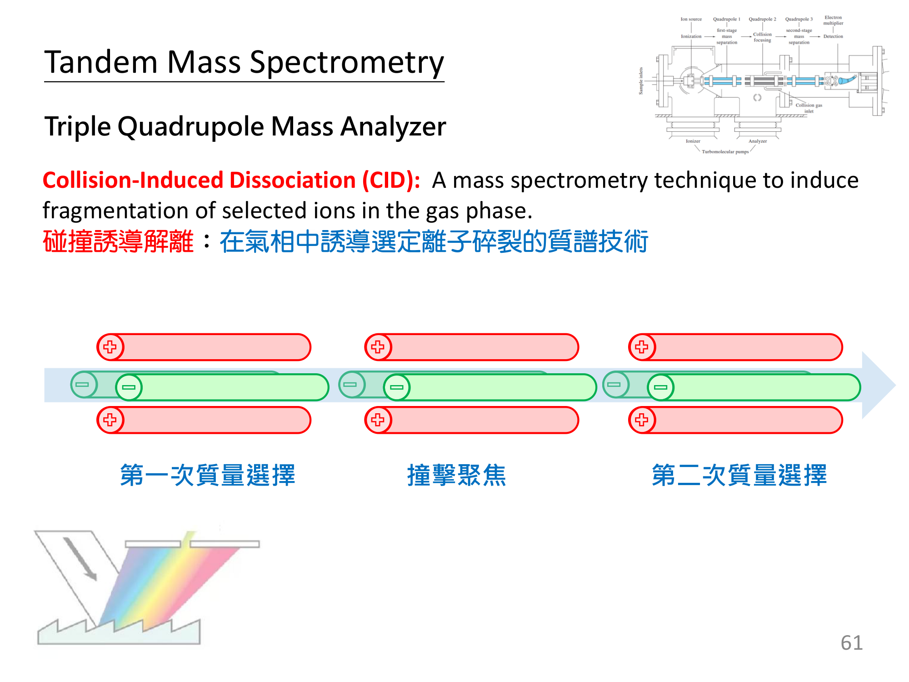

**為什麼需要串聯質譜？**

問題：**同分異構物（Isomers）** 有相同的分子式但結構不同，一般質譜無法區分。

例如：正丁醇和異丁醇都是 C₄H₁₀O，分子量一樣，但結構不同。

**MS/MS 的解決方案**：
1. 第一台 MS 選出目標離子（母離子）
2. 用碰撞氣體撞擊，讓它碎裂
3. 第二台 MS 分析碎片離子（子離子）
4. 不同結構的異構物會產生不同的碎片模式

🔑 **重點提示**：MS/MS 就是為了解決同分異構物的問題——結構不同，碎片就不同。

---

## Page 58: CID 碰撞誘導解離

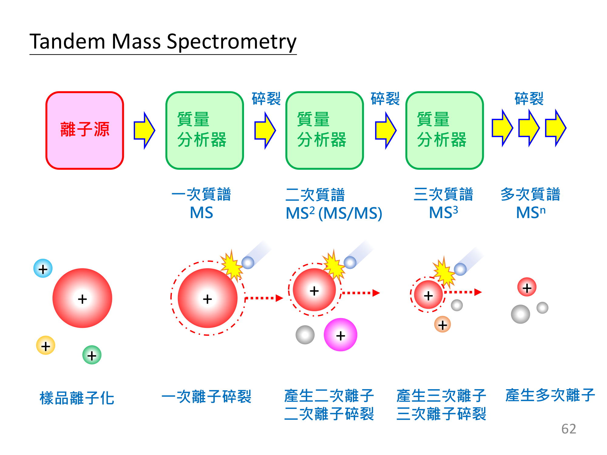

**CID（Collision-Induced Dissociation）**：

使用**三重四極柱（Triple Quadrupole）**：

1. **Q1（第一重）**：質量選擇——只讓目標 m/z 的離子通過
2. **Q2（第二重）**：碰撞室——通入碰撞氣體（如 Ar），讓離子撞擊碎裂
3. **Q3（第三重）**：質量分析——分析碎片的 m/z

流程：**選出母離子 → 撞碎 → 分析子離子**

CID 的能量可以調整：
- 低能量 → 碎片少
- 高能量 → 碎片多

🔑 **重點提示**：三重四極柱 = Q1 選 + Q2 撞 + Q3 析。CID 是 MS/MS 最常用的碎裂方式。

---

## Page 59: MSⁿ 層級

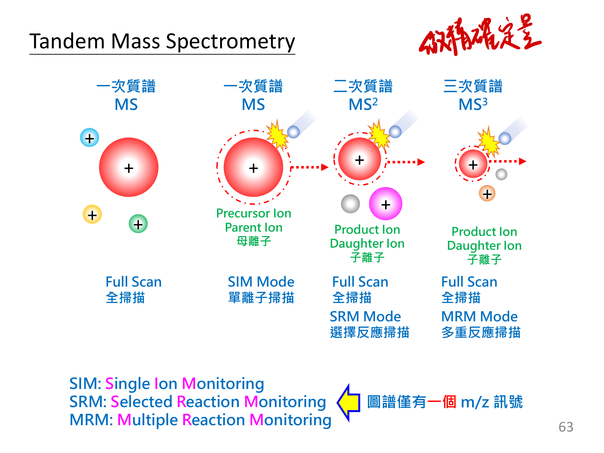

**串聯質譜可以做到多層碎裂**：

- **MS（MS¹）**：一般的質譜，分析 m/z
- **MS²（MS/MS）**：選一個離子，撞碎，分析碎片
- **MS³**：從 MS² 的碎片中再選一個，再撞碎
- **MSⁿ**：重複 n 次

離子阱最擅長做 MSⁿ（可以反覆捕捉和碎裂），三重四極柱只能做 MS²。

🔑 **重點提示**：離子阱可以做 MSⁿ（n 可以很大），三重四極柱只能做 MS²。

---

## Page 60: 四種掃描模式

MS/MS 有四種主要的掃描模式：

1. **Product Ion Scan（子離子掃描）**：
   - 固定母離子 m/z，掃描所有子離子
   - 問題：這個離子碎裂後會產生什麼？

2. **Precursor Ion Scan（母離子掃描）**：
   - 固定子離子 m/z，掃描所有可能的母離子
   - 問題：哪些離子會產生這個碎片？

3. **Neutral Loss Scan（中性丟失掃描）**：
   - 固定中性丟失的質量，掃描所有符合的母離子
   - 問題：哪些離子會丟失這個質量？

4. **SRM/MRM（選擇反應監測）**：
   - 固定母離子和子離子的 m/z 對
   - 只監測特定的轉換，最靈敏、最專一

🧠 **記憶口訣**：**子離子掃描看碎什麼，母離子掃描找誰碎的，中性丟失看丟什麼，SRM看特定轉換**。

---

## Page 61: 碰撞能量與 Oseltamivir

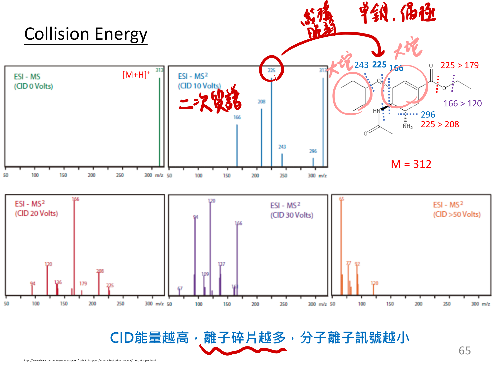

以 **Oseltamivir（克流感）** 為例：

CID 碰撞能量的影響：
- **低能量** → 分子離子峰強，碎片少
- **高能量** → 碎片多，分子離子峰弱

這跟離子源的硬/軟概念一樣：
- 能量低 = 軟 → 看到完整分子
- 能量高 = 硬 → 看到很多碎片

實務上會調整碰撞能量，找到最適合的條件來觀察特定的碎片。

🔑 **重點提示**：碰撞能量是 CID 的可調參數，能量越高碎片越多分子離子越小。

---

## Page 62: Product Ion Scan 示意圖

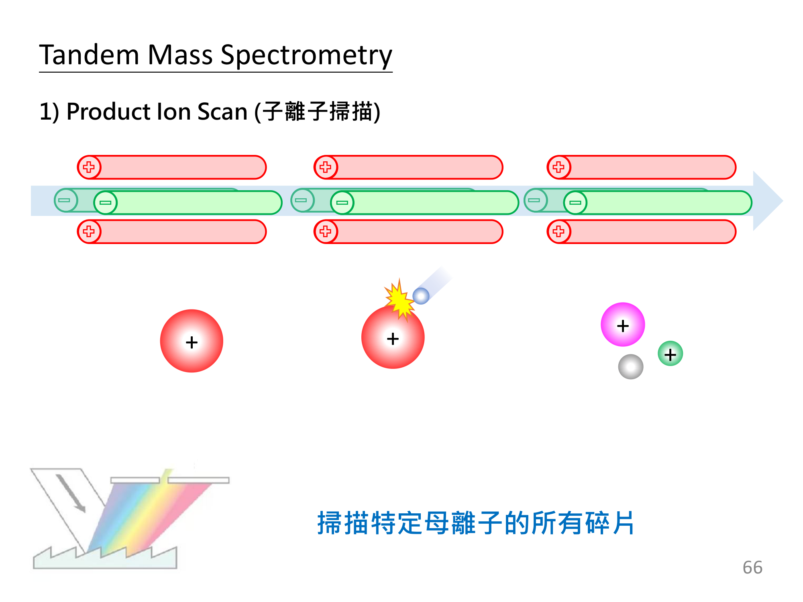

**Product Ion Scan（子離子掃描）**：

1. Q1 固定一個母離子 m/z（只讓它通過）
2. Q2 撞碎
3. Q3 掃描所有子離子的 m/z

結果：得到這個母離子的**碎片圖譜**

應用場景：
- 已知分子量，想知道結構
- 確認特定化合物的碎片模式
- 建立化合物的質譜指紋

🔑 **重點提示**：Product Ion Scan = 固定母離子，掃子離子。最直覺的 MS/MS 模式。

---

## Page 63: Precursor Ion Scan 示意圖

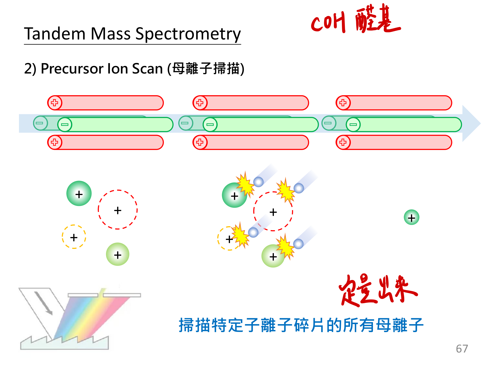

**Precursor Ion Scan（母離子掃描）**：

1. Q1 掃描所有母離子 m/z
2. Q2 撞碎
3. Q3 固定一個子離子 m/z（只接收這個碎片）

結果：找到所有會產生這個子離子的母離子

應用場景：
- 想找哪些化合物含有特定官能基
- 例如：掃描 m/z = 91 的母離子 → 找到所有含草鎖離子的化合物
- 藥物代謝物篩選

🔑 **重點提示**：Precursor Ion Scan = 掃母離子，固定子離子。反過來找的邏輯。

---

## Page 64: Neutral Loss Scan 示意圖

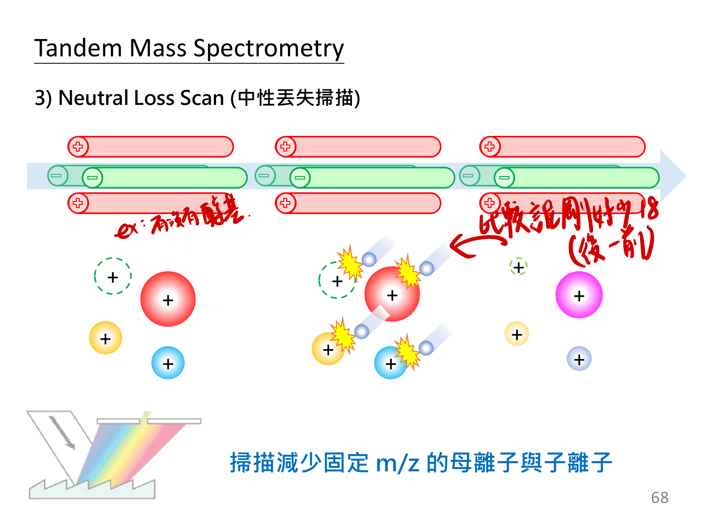

**Neutral Loss Scan（中性丟失掃描）**：

1. Q1 和 Q3 同時掃描，但保持固定的 m/z 差值
2. 如果 Q1 和 Q3 的差值 = 某個中性分子的質量
3. 就記錄這個母離子

例如：掃描中性丟失 18（H₂O）
- 找到所有會脫水的化合物
- m/z 100 → m/z 82（丟了 18）✓
- m/z 150 → m/z 132（丟了 18）✓

應用場景：
- 找特定官能基的化合物（如脫水 = 醇類，脫 42 = 乙醯基）
- 藥物篩選

🔑 **重點提示**：Neutral Loss = Q1 和 Q3 同步掃描，固定差值。找「誰丟了什麼」。

---

## Page 65: SRM 示意圖

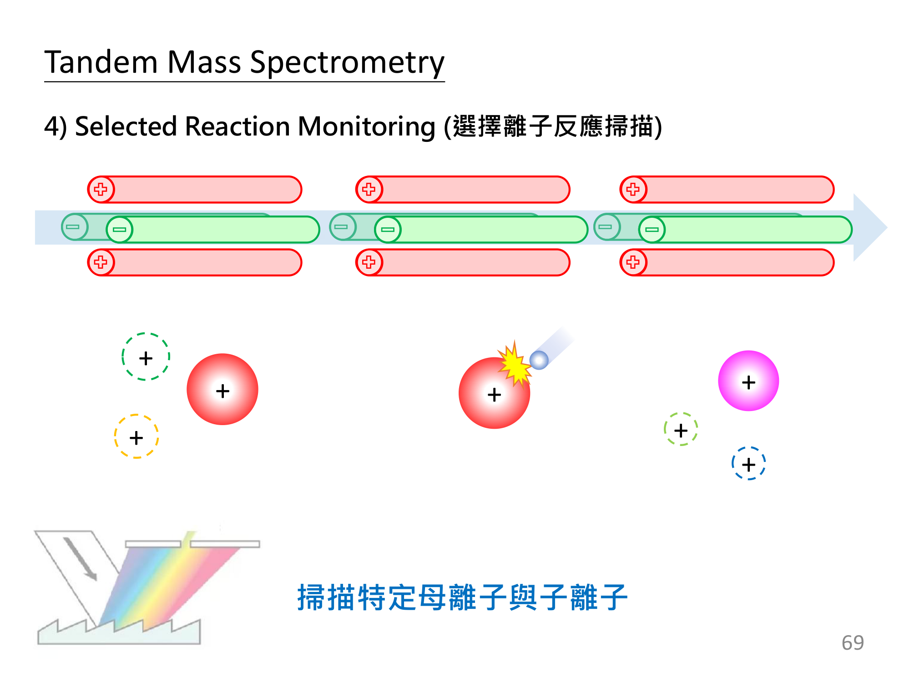

**SRM（Selected Reaction Monitoring）/ MRM（Multiple Reaction Monitoring）**：

1. Q1 固定母離子 m/z
2. Q2 撞碎
3. Q3 固定子離子 m/z

結果：只監測一個特定的「母離子 → 子離子」轉換

**SRM 的特點**：
- 最靈敏的掃描模式（因為只看一個轉換，雜訊最少）
- 最專一（幾乎不會誤判）
- 常用於定量分析

**MRM**：同時監測多個轉換對

應用場景：
- 藥物濃度定量
- 食品安全檢測（農藥、添加物）
- 臨床檢驗

🔑 **重點提示**：SRM = 最靈敏最專一的模式，固定母→子。定量分析的首選。

---

## Page 66: Summary

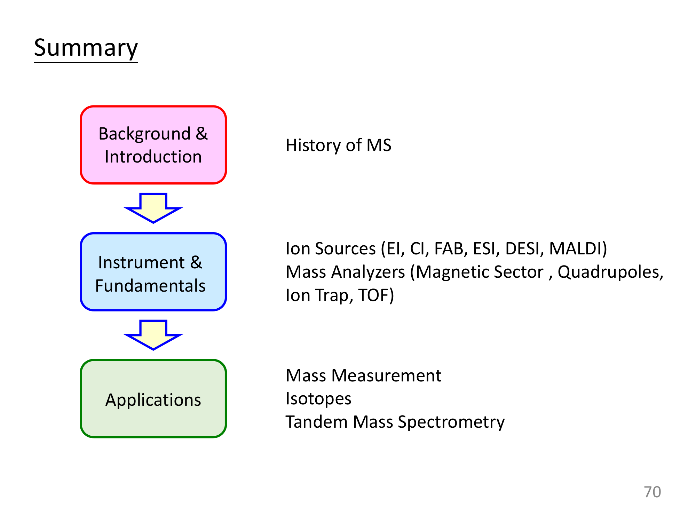

Chapter 20 重點回顧：

**離子源**：
- EI（硬）→ CI、FAB、MALDI、ESI、DESI（軟）
- 硬 = 碎片多結構清；軟 = 分子量易知

**質量分析器**：
- 磁扇區（高解析、貴）
- 四極柱（小便宜、範圍小）
- 離子阱（MSⁿ、靈敏）
- TOF（大範圍、快）

**碎片規律**：
- 醛：m/z = 29 基峰
- 酮：m/z = 43 基峰
- 醇：m/z = 31，[M-18] 或 [M-1]
- 芳香族：m/z = 91 草鎖離子

**同位素**：
- Cl：3:1，Br：1:1，雙Cl：9:6:1

**串聯質譜**：
- CID、MSⁿ、四種掃描模式

---

## Page 67: Homework

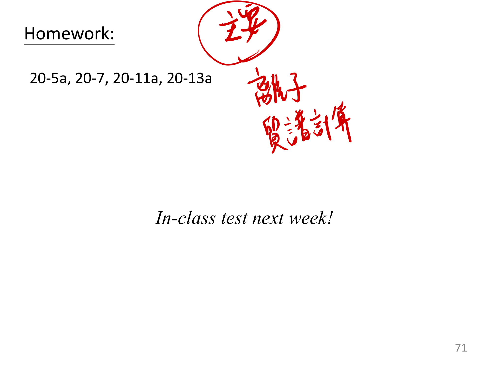

作業：
- **20-5a**
- **20-7**
- **20-11a**
- **20-13a**

⚠️ **下週隨堂考！**

🔑 **重點提示**：隨堂考範圍就是這章，計算題（KE、磁扇區、解析度）和概念題（離子源、分析器、碎片模式）都要準備。

---

## Page 68: Review — 定義複習

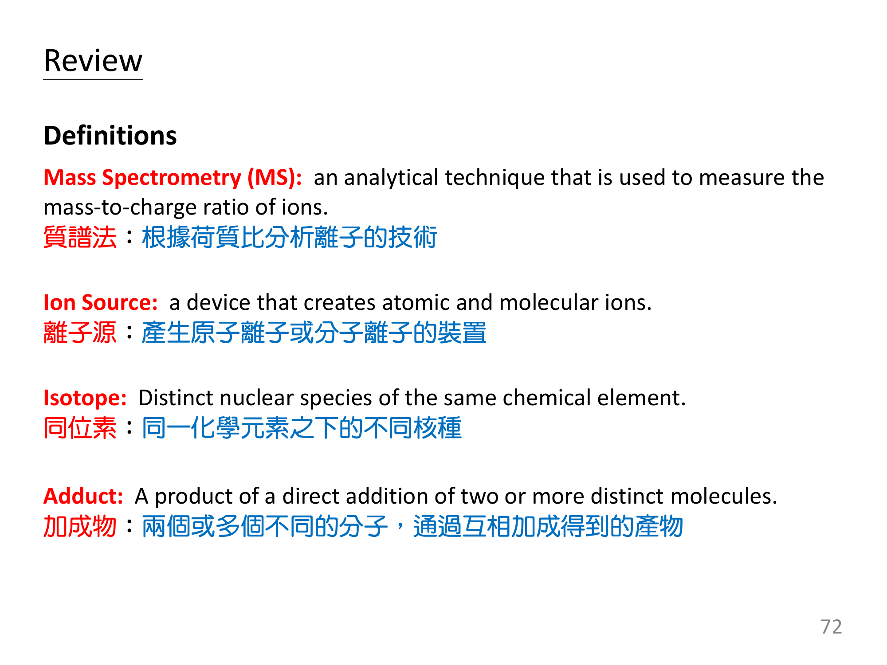

複習重要定義：

1. **質譜法**：根據荷質比（m/z）分析離子的技術
2. **離子源**：產生離子的裝置
3. **硬離子源**：能量大，碎片多，結構資訊豐富
4. **軟離子源**：能量小，碎片少，分子量容易判斷
5. **分子離子峰**：M⁺•（EI）或 [M+H]⁺（CI/ESI/MALDI）
6. **基峰**：質譜中最強的峰，設為 100%
7. **同位素峰**：同一元素不同同位素產生的峰

---

## Page 69: Review — 公式複習（一）

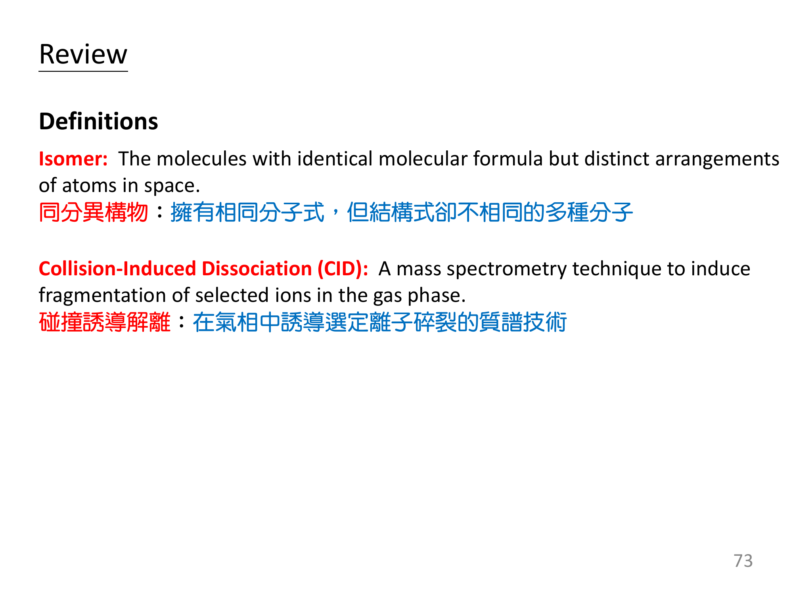

必背公式：

1. **動能**：KE = zeV
   - z = 電荷數，e = 基本電荷，V = 加速電壓

2. **磁扇區**：m/z = B²r²e / 2V
   - B = 磁場強度，r = 偏轉半徑，e = 基本電荷，V = 加速電壓

3. **磁扇區（加速電壓形式）**：V = B²r²ze / 2m

4. **TOF**：速度 v = √(2zeV/m)，飛行時間 t ∝ √(m/z)

---

## Page 70: Review — 公式複習（二）

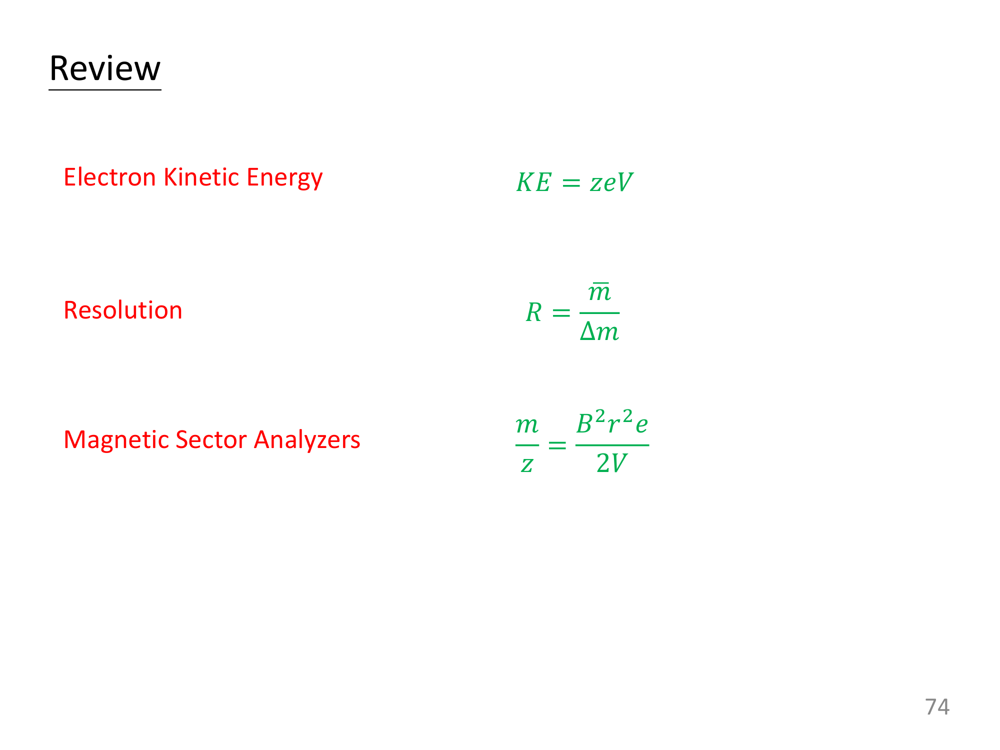

5. **解析度**：R = m̄ / Δm
   - m̄ = 兩峰平均 m/z，Δm = 兩峰質量差

6. **同位素比例**：
   - 含 1 個 Cl：M : M+2 = 3 : 1
   - 含 1 個 Br：M : M+2 ≈ 1 : 1
   - 含 2 個 Cl：M : M+2 : M+4 = 9 : 6 : 1

7. **四極柱穩定圖**：
   - m/z 適中 → 穩定通過
   - m/z 太小 → 不穩定震盪
   - m/z 太大 → 推向外側

8. **CID 流程**：Q1（選）→ Q2（撞）→ Q3（析）

---

## 🔥 期末必背總整理

### 離子源口訣
**硬碎結構清，軟整分子明**
- EI = 硬（70 eV）
- CI = 軟（間接游離）
- FAB = 軟（快原子撞）
- MALDI = 軟（基質幫忙）
- ESI = 軟（電灑多電荷）
- DESI = 軟（免前處理）

### 碎片口訣
- **醛 29**，**酮 43**，**醇 31**，**芳香族 91**
- 醇：短鏈脫氫(-1)，長鏈脫水(-18)
- 酯：偏好斷 C-O 鍵

### 同位素口訣
- **Cl 3:1**，**Br 1:1**，**雙Cl 9:6:1**

### 分析器口訣
- **磁扇區**：高準貴大慢
- **四極柱**：小便宜快
- **離子阱**：MSⁿ 小靈敏
- **TOF**：大範圍超快

### 四種掃描模式口訣
- **Product Ion**：固定母離子，看碎什麼
- **Precursor Ion**：固定子離子，找誰碎的
- **Neutral Loss**：固定丟失量，找誰丟了
- **SRM**：固定母→子，最靈敏

### 必背公式
- KE = zeV
- m/z = B²r²e / 2V
- R = m̄ / Δm

---

*筆記完成！祝期末考順利 🎉*