# Chapter 22-25 電分析化學 超詳細筆記

> 🎯 期末複習專用 | 化學系大三 | 40 頁投影片逐頁拆解

---

## Page 1: Chapter 22-25 Electroanalytical Chemistry

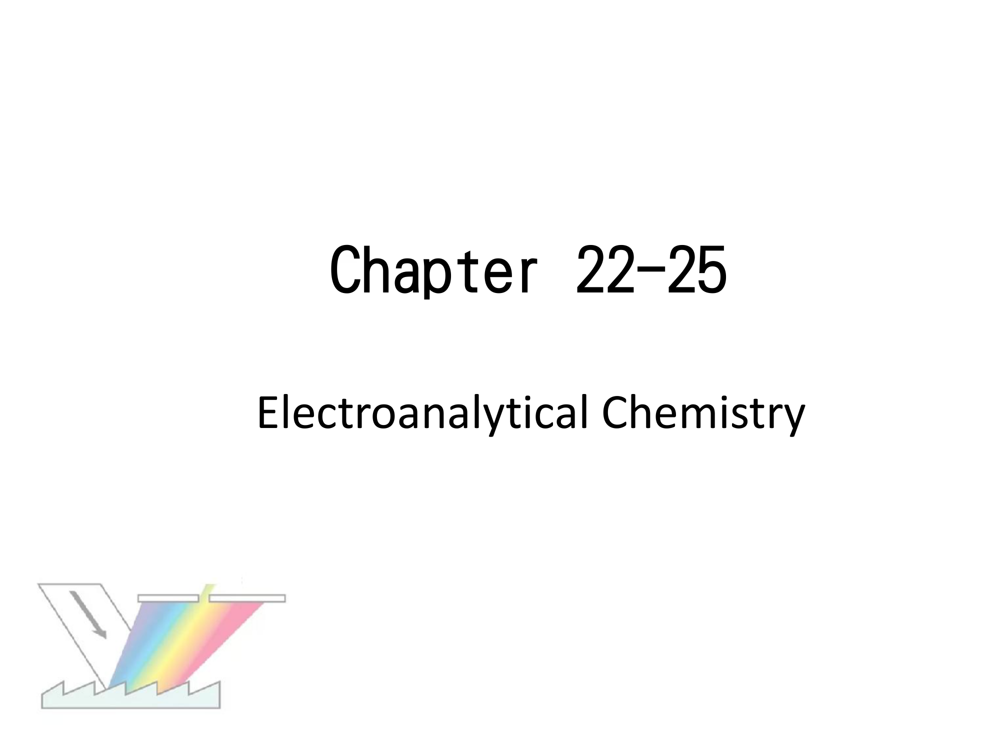

這是整個電分析化學的開場頁，涵蓋 Chapter 22 到 25 的內容。電分析化學是儀器分析中專門處理「氧化還原活性物質」的分析方法，核心概念圍繞在電位、電流、以及它們和濃度之間的關係。

💡 **重點提示**：這幾章是一條線串起來的 — 從最基礎的氧化還原 → 電極電位 → Nernst 方程式 → 伏安法，最後到安培法。基礎沒打好，後面全部會霧煞煞。

---

## Page 2: 儀器分析地圖 — YOU ARE HERE!

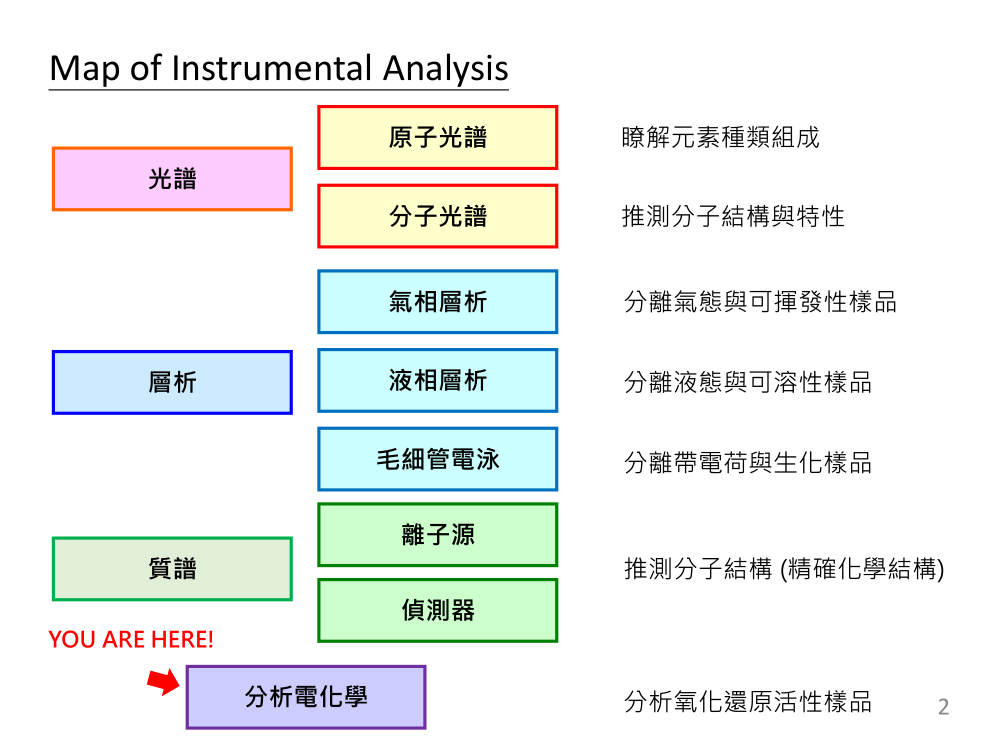

儀器分析有很多分支：光譜法、色層分析法、質譜法等等。電化學分析法在這個地圖中的位置是「分析氧化還原活性的樣品」。

白話說：如果你的樣品會得失電子（也就是有氧化還原活性），電化學就是你的工具。像是金屬離子、有機氧化還原分子、酵素反應等等。

🔑 **記憶口訣**：電化學 = 電子跑來跑去 = 氧化還原

---

## Page 3: 氧化還原反應

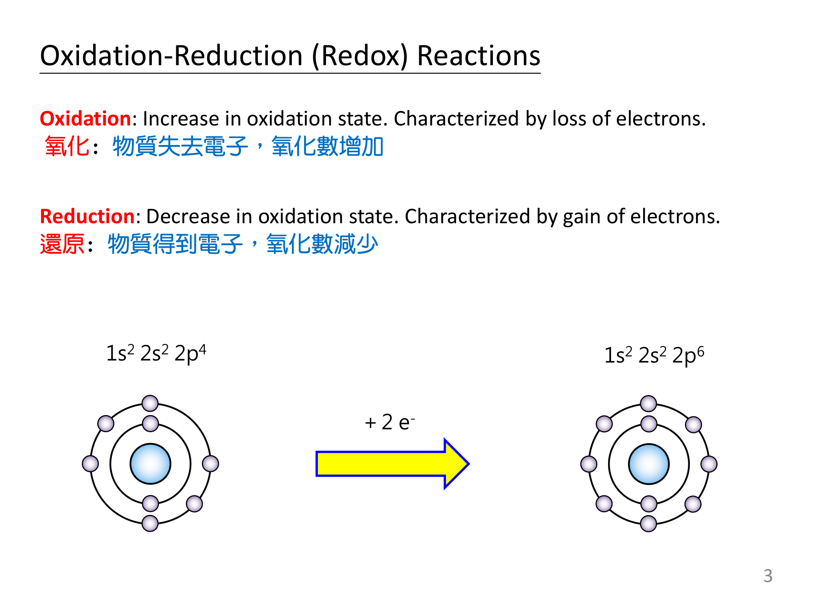

**氧化（Oxidation）**：失去電子，氧化數增加
- 記法：LEO — Lose Electrons = Oxidation

**還原（Reduction）**：得到電子，氧化數減少
- 記法：GER — Gain Electrons = Reduction

合起來：**LEO says GER** 🔥

範例：O (1s²2s²2p⁴) + 2e⁻ → O²⁻ (1s²2s²2p⁶)
- 氧原子得到 2 個電子，從氧化數 0 變成 -2
- 這是還原反應（得到電子）

⚠️ **常見陷阱**：很多人搞混「被氧化」和「氧化劑」。氧化劑是讓別人被氧化的東西，所以氧化劑自己會被還原！

💡 **重點提示**：氧化還原一定同時發生 — 有人失去電子，就一定有人得到電子。不可能只有氧化沒有還原。

---

## Page 4: 電化學電池

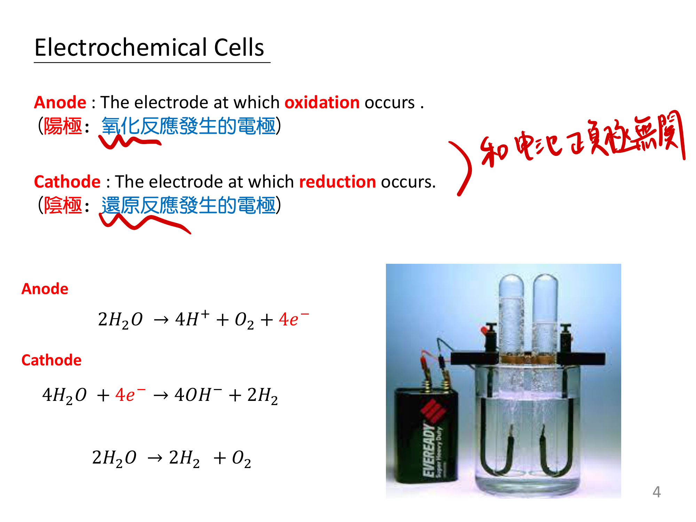

電化學電池有兩個電極，各司其職：

| 電極 | 發生什麼 | 記法 |
|------|---------|------|
| **陰極 Cathode** | 還原反應（得到電子） | Cathode = 還原 = Reduction |
| **陽極 Anode** | 氧化反應（失去電子） | Anode = 氧化 = Oxidation |

🔑 **記憶口訣**：**Cathode 還原，Anode 氧化**（Cat還、An氧）

電解水的例子：
- 陽極（氧化）：2H₂O → 4H⁺ + O₂ + 4e⁻（水被氧化，產生氧氣）
- 陰極（還原）：4H₂O + 4e⁻ → 4OH⁻ + 2H₂（水被還原，產生氫氣）

💡 **重點提示**：在電解池中，陽極接正極，陰極接負極。但在化學電池（放電池）中反過來！考試最愛考這個。

---

## Page 5: 電極電位 — Plus Right Rule

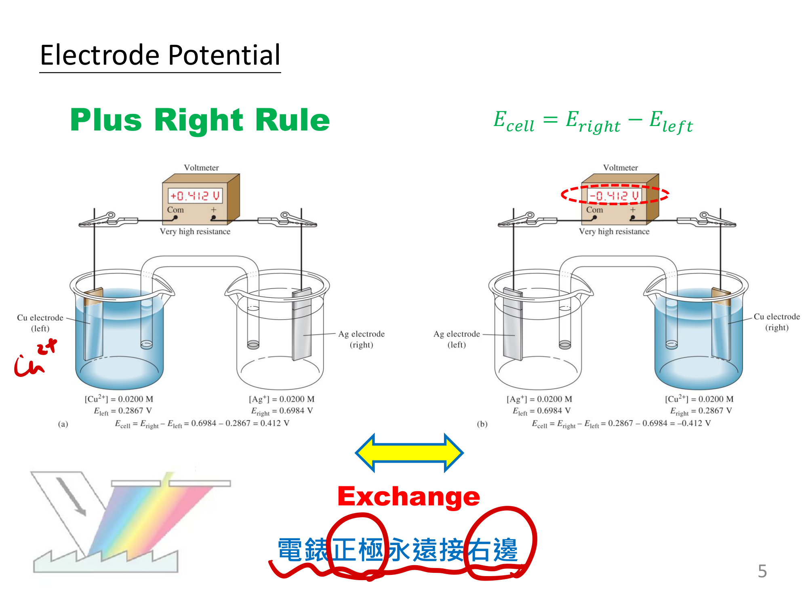

**Plus Right Rule（正極右邊規則）**：電錶的正極永遠接右邊的半電池。

電池電位的計算公式：

**E_cell = E_right - E_left**

白話說：右邊的電極電位減左邊的電極電位，就是整個電池的電動勢。

為什麼要這樣規定？因為我們量測的電壓就是右邊相對於左邊的電位差。如果你把正負極接反，電壓就變負的，代表反應方向要反過來。

💡 **重點提示**：E_cell > 0 代表反應自發進行；E_cell < 0 代表反應非自發，需要外加能量。

---

## Page 6: 電池表示法

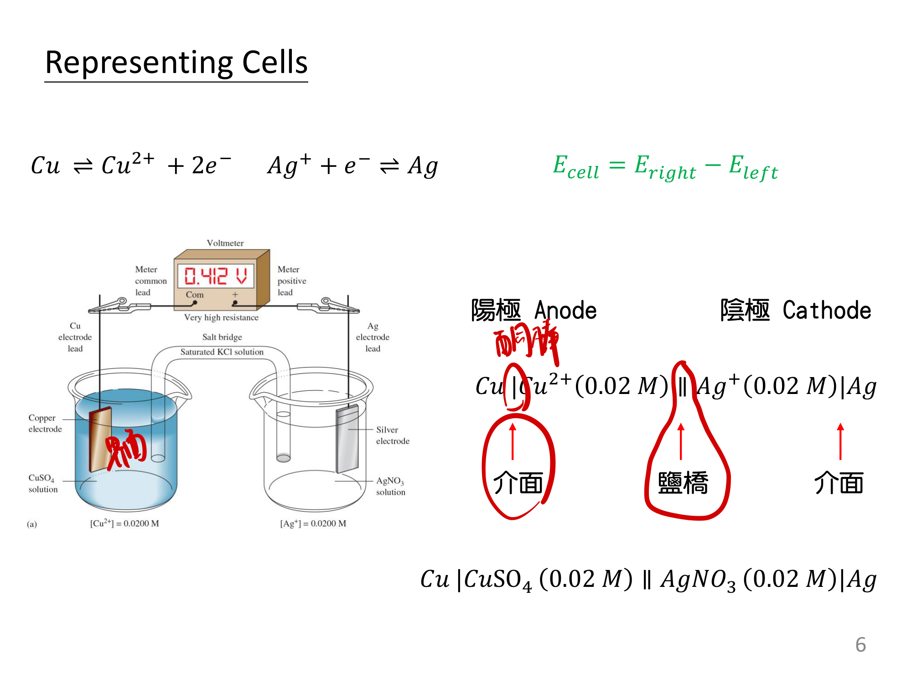

電池用一串符號表示：

**Cu | Cu²⁺(0.02M) || Ag⁺(0.02M) | Ag**

符號解讀：
- `|`：相界（phase boundary），固體和溶液的介面
- `||`：鹽橋（salt bridge），連接兩個半電池
- 左邊 Cu|Cu²⁺：陽極（Anode，氧化端）
- 右邊 Ag⁺|Ag：陰極（Cathode，還原端）

完整反應：
- 陽極（氧化）：Cu → Cu²⁺ + 2e⁻
- 陰極（還原）：Ag⁺ + e⁻ → Ag

🔑 **記憶口訣**：**左氧右還**（左邊Anode氧化，右邊Cathode還原）

💡 **重點提示**：寫電池表示法時，左邊是陽極、右邊是陰極，跟 Plus Right Rule 一致。濃度要標在括號裡。

---

## Page 7: 電位變化 — 電壓不是永恆的

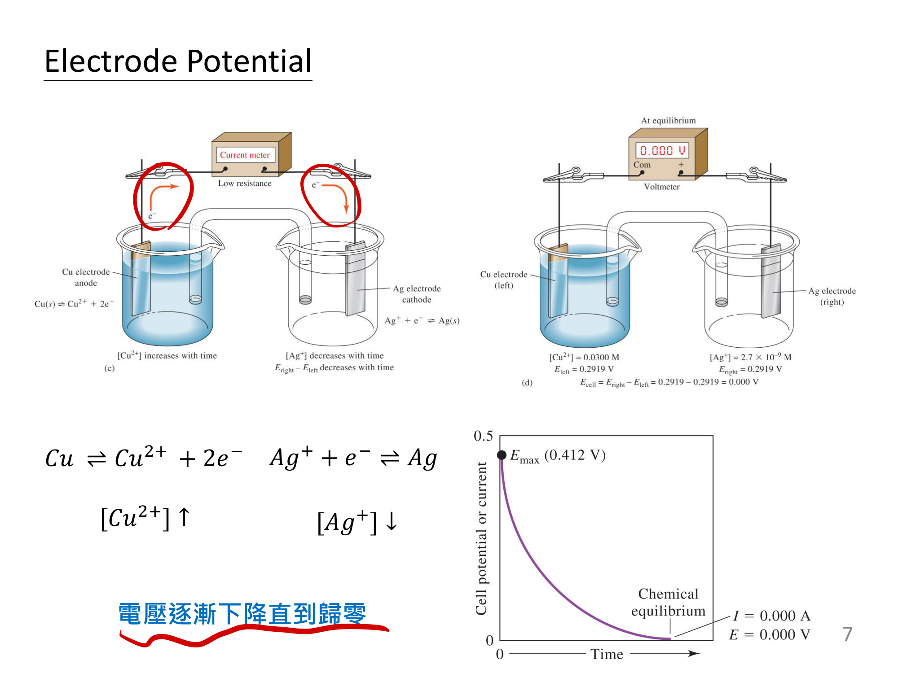

電池放電時，電壓會一直變化：

- [Ag⁺] 下降（Ag⁺被還原成Ag，濃度減少）
- [Cu²⁺] 上升（Cu被氧化成Cu²⁺，濃度增加）
- 結果：電壓逐漸下降，最後趨近零

這告訴我們一個重要觀念：**我們無法量測絕對電壓**。任何一個半電池的絕對電位是多少，我們不知道。我們只能量測兩個半電池之間的電位差。

🔑 **記憶口訣**：電壓會跑、絕對量不到

💡 **重點提示**：這就是為什麼我們需要參考電極（下一頁開始講的 SHE）— 因為單一電極的絕對電位量不到，只能跟一個基準比較。

---

## Page 8: 標準氫電極 SHE

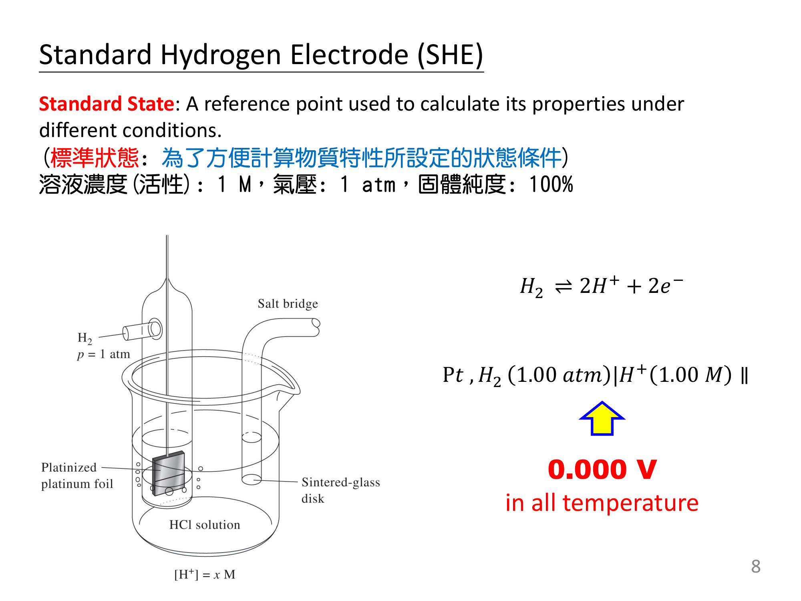

**SHE = Standard Hydrogen Electrone（標準氫電極）**

表示法：Pt, H₂(1atm) | H⁺(1M)

**E° = 0.000 V（所有溫度下都是 0！）**

標準狀態三條件：
1. 濃度 1 M
2. 氣體壓力 1 atm
3. 純度 100%

白話說：SHE 就像海平面 — 所有山的高度都從海平面算起，所有電極電位都從 SHE 算起。SHE 本身的電位定義為 0，所以任何電極跟 SHE 比出來的電位，就是那個電極的標準電極電位。

🔑 **記憶口訣**：**SHE 是電化學的海平面，永遠 = 0.000 V**

⚠️ **常見陷阱**：考試可能問「SHE 在 100°C 時 E° 是多少？」答案還是 0.000 V！所有溫度都是！

---

## Page 9: Ag 標準電極電位

把 Ag 電極跟 SHE 組成電池：

**SHE || Ag⁺(1M) | Ag**

電池電位：
E_cell = E_right - E_left
E_cell = E_Ag - E_SHE
E_cell = E_Ag - 0.000
E_cell = E_Ag

實測結果：E_cell = +0.799 V

所以 E°_Ag = +0.799 V

**正電位 = 自發反應**

白話說：Ag⁺ 很想搶電子變成 Ag，比 H⁺ 更想，所以 Ag 的電極電位比 SHE 高。正的代表這個還原反應自己就會跑，不需要幫忙。

💡 **重點提示**：E° 越正，表示那個離子越容易被還原（越想搶電子）。

---

## Page 10: Cd 標準電極電位

把 Cd 電極跟 SHE 組成電池：

**SHE || Cd²⁺(1M) | Cd**

實測結果：E_cell = -0.403 V

所以 E°_Cd = -0.403 V

**負電位 = 非自發反應**

這代表什麼？Cd 不想變成 Cd²⁺ 嗎？不，恰恰相反 — Cd 很想氧化（失去電子），所以 Cd 比 H₂ 更容易被氧化。

白話說：Cd 的還原反應（Cd²⁺ + 2e⁻ → Cd）是不自發的。反過來看，Cd 的氧化反應（Cd → Cd²⁺ + 2e⁻）才是自發的。

🔑 **記憶口訣**：**正電位 = 還原自發；負電位 = 氧化自發**

💡 **重點提示**：所有標準電極電位表上的值都是「還原電位」。如果反應方向反過來，電位要變號。

---

## Page 11: 標準電極電位五大重點

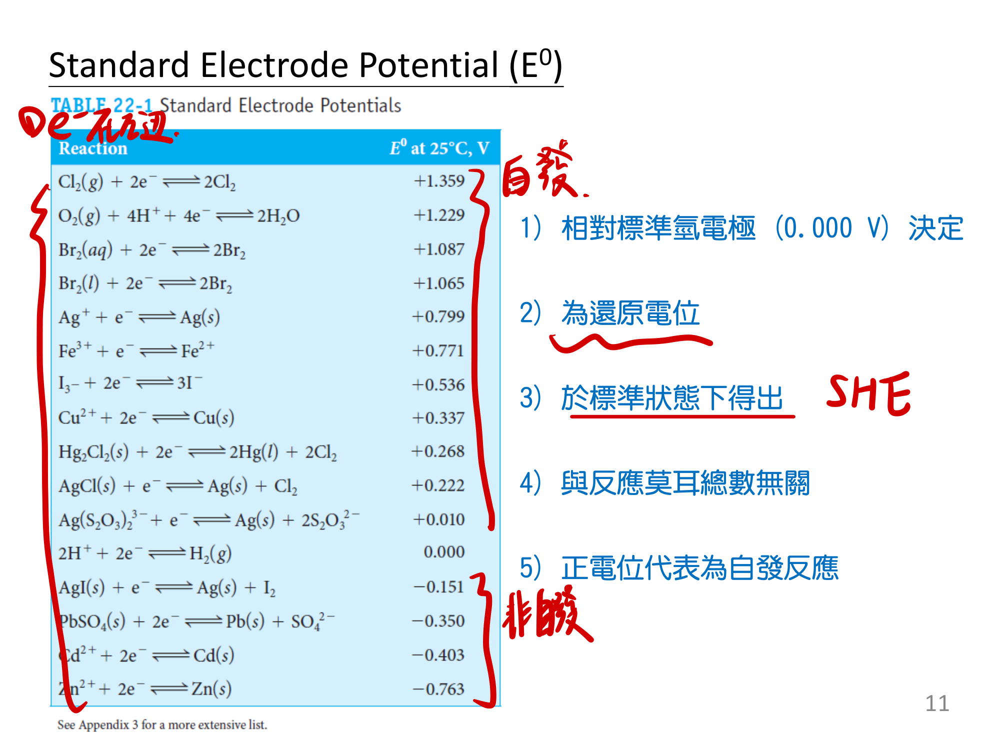

這頁是必考重點，一個都不能漏：

1. **相對 SHE（0.000 V）決定**：所有電極電位都是跟 SHE 比出來的，沒有絕對值
2. **為還原電位**：表上列出來的 E° 都是還原反應的電位（金屬離子得到電子變金屬）
3. **標準狀態下得出**：1 M、1 atm、25°C，這些條件缺一不可
4. **與反應莫耳數無關**：把反應式乘以 2，E° 不會變！這是電位不是能量，跟計量係數無關
5. **正電位 = 自發反應**：E° > 0 表示還原反應自發，E° < 0 表示氧化反應自發

🔑 **超重要口訣**：**相對SHE、還原電位、標準狀態、莫耳無關、正=自發**

⚠️ **第4點最容易搞混**：ΔG 和反應莫耳數有關（ΔG = -nFE），但 E° 不受影響！考試愛考這個。

---

## Page 12: Nernst Equation

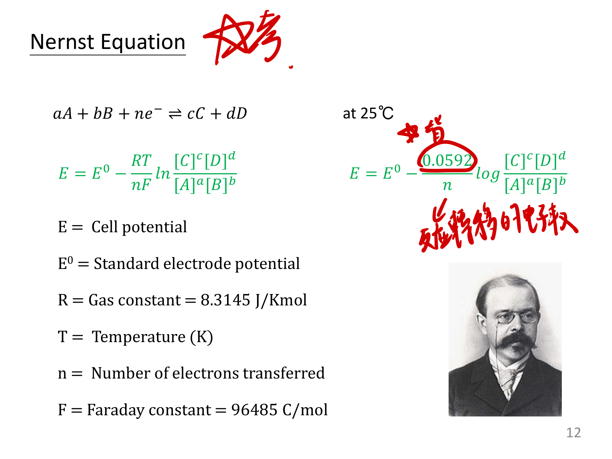

**Nernst 方程式**是整個電分析化學最重要的公式，沒有之一。

完整版：
**E = E° - (RT/nF) × ln([C]^c × [D]^d / [A]^a × [B]^b)**

25°C 簡化版：
**E = E° - (0.0592/n) × log([C]^c × [D]^d / [A]^a × [B]^b)**

各符號意思：
- E：非標準狀態下的電極電位
- E°：標準電極電位
- R：氣體常數 = 8.314 J/(mol·K)
- T：絕對溫度（K）
- n：轉移電子數
- F：法拉第常數 = 96485 C/mol
- [A]、[B]：反應物濃度（還原反應的左邊）
- [C]、[D]：產物濃度（還原反應的右邊）

🔑 **記憶口訣**：**E 等於 E° 減掉那坨東西**。那坨東西是「產物除以反應物」的對數。

⚠️ **注意事項**：
- 純固體和液體的濃度 = 1，不用寫
- 25°C 時 RT/F × ln = 0.0592 × log，這個 0.0592 是考試必背數字
- 自然對數 ln 和常用對數 log 差 2.303 倍

---

## Page 13: 三個 Nernst 範例

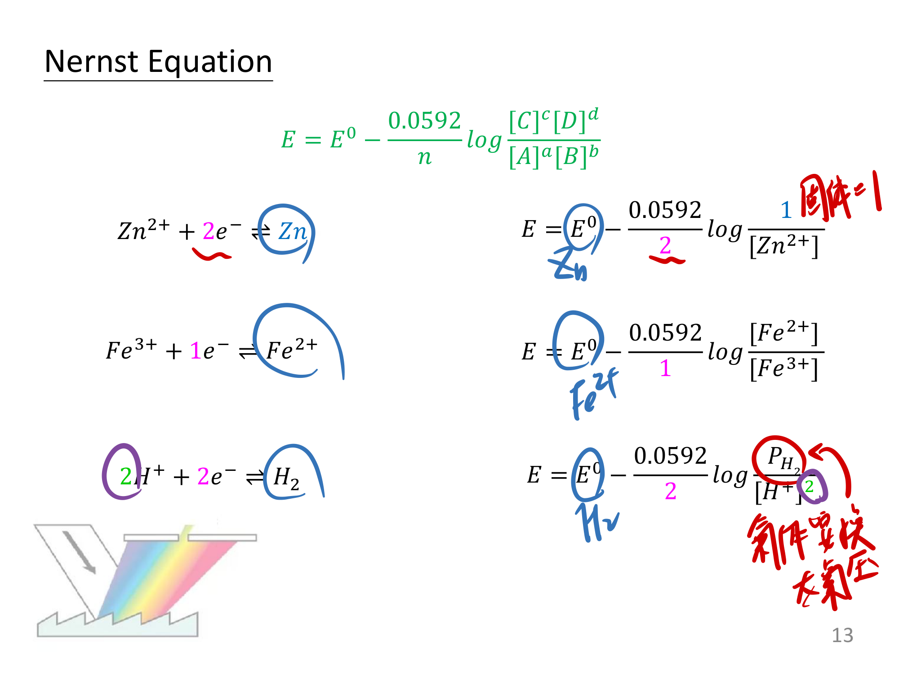

三個半反應的 Nernst 方程式寫法：

**1. Zn²⁺ + 2e⁻ ⇌ Zn**
E = E° - (0.0592/2) × log(1/[Zn²⁺])
= E° + (0.0592/2) × log[Zn²⁺]
（Zn 是固體，濃度 = 1，所以只剩 [Zn²⁺] 在分母，翻上去變 log[Zn²⁺]）

**2. Fe³⁺ + e⁻ ⇌ Fe²⁺**
E = E° - (0.0592/1) × log([Fe²⁺]/[Fe³⁺])
（n=1，只有一個電子轉移）

**3. 2H⁺ + 2e⁻ ⇌ H₂**
E = E° - (0.0592/2) × log(P_H2/[H⁺]²)
（H₂ 是氣體用分壓 P，H⁺ 有 2 莫耳所以要平方）

💡 **重點提示**：
- 固體和液體不出現在 Q 裡面（活度 = 1）
- 氣體用分壓（atm）
- 溶液用濃度（M）
- 係數要變次方！

---

## Page 14: Example 22-2 — Cd²⁺ 非標準濃度計算

題目：Cd²⁺ 濃度 = 0.0150 M，求電極電位

步驟拆解：

**1. 寫出半反應：**
Cd²⁺ + 2e⁻ ⇌ Cd

**2. 找出已知量：**
- E° = -0.403 V
- n = 2（2 個電子）
- [Cd²⁺] = 0.0150 M
- Cd 是固體，[Cd] = 1

**3. 代入 Nernst 方程式：**
E = E° - (0.0592/n) × log(1/[Cd²⁺])
E = -0.403 - (0.0592/2) × log(1/0.0150)
E = -0.403 - 0.0296 × log(66.67)
E = -0.403 - 0.0296 × 1.823
E = -0.403 - 0.054
**E = -0.457 V**

🔑 **計算小技巧**：log(1/x) = -log(x)，所以 -log(1/[Cd²⁺]) = log[Cd²⁺]。也就是說濃度比 1 M 小，電位會更負。

💡 **重點提示**：金屬離子濃度越低，電極電位越負（越不利於還原）。這在後面的電位滴定很常用。

---

## Page 15: Ag/AgCl 電極電位計算

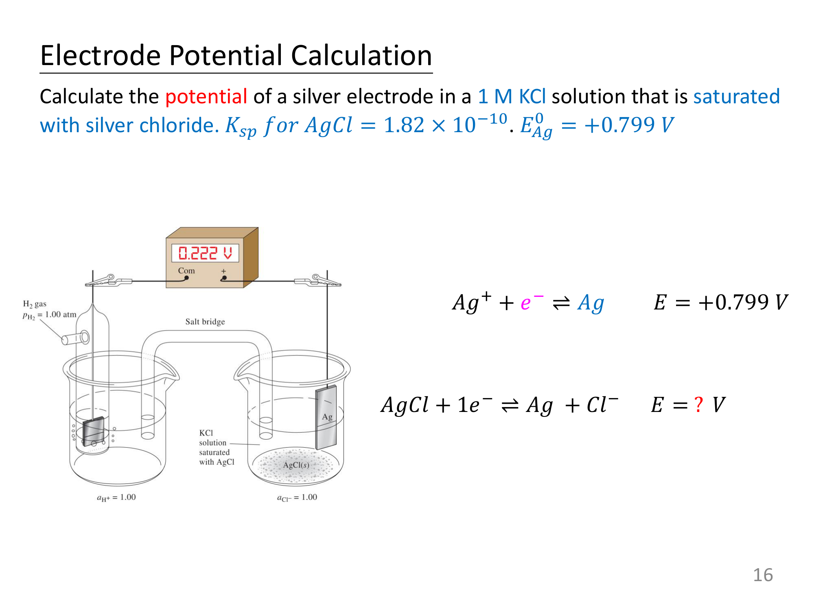

這是一個經典考題類型：**有沉澱的電極電位**

半反應：Ag⁺ + e⁻ ⇌ Ag
E° = +0.799 V

但問題來了：如果溶液中有 Cl⁻，Ag⁺ 會跟 Cl⁻ 形成沉澱 AgCl，所以 [Ag⁺] 不是 1 M 了！

Ksp(AgCl) = 1.82 × 10⁻¹⁰

這時候要怎麼算？先留著，下一頁拆解。

💡 **關鍵概念**：當有沉澱生成時，金屬離子的實際濃度被壓低了（因為大部分都沉澱了），這會影響電極電位。這就是 Ag/AgCl 參考電極的原理 — 故意加 Cl⁻ 來壓低 Ag⁺ 濃度，得到一個穩定的電位。

---

## Page 16: Example A 詳解 — Ag/AgCl 電位

承接上一頁，逐步計算 Ag/AgCl 電極的電位：

**Step 1：用 Ksp 求 [Ag⁺]**
AgCl ⇌ Ag⁺ + Cl⁻
Ksp = [Ag⁺][Cl⁻] = 1.82 × 10⁻¹⁰

假設 [Cl⁻] = 1 M（飽和 KCl 溶液）：
[Ag⁺] = Ksp / [Cl⁻] = 1.82 × 10⁻¹⁰ / 1 = 1.82 × 10⁻¹⁰ M

**Step 2：代回 Nernst 方程式**
E = E° - (0.0592/1) × log(1/[Ag⁺])
E = 0.799 - 0.0592 × log(1/1.82 × 10⁻¹⁰)
E = 0.799 - 0.0592 × log(5.49 × 10⁹)
E = 0.799 - 0.0592 × 9.740
E = 0.799 - 0.577
**E = 0.222 V**

另一種算法（更快）：
E = E° + (0.0592/1) × log[Ag⁺]
E = 0.799 + 0.0592 × log(1.82 × 10⁻¹⁰)
E = 0.799 + 0.0592 × (-9.740)
E = 0.799 - 0.577
E = 0.222 V

🔑 **記憶重點**：Ag/AgCl 電極在飽和 KCl 中的電位 = **0.197 V**（跟計算值 0.222 V 不完全一樣，因為活度係數的影響，考試用 0.197 V 或 0.222 V 看題目給的條件）

---

## Page 17: 電位差變化 — 再次強調

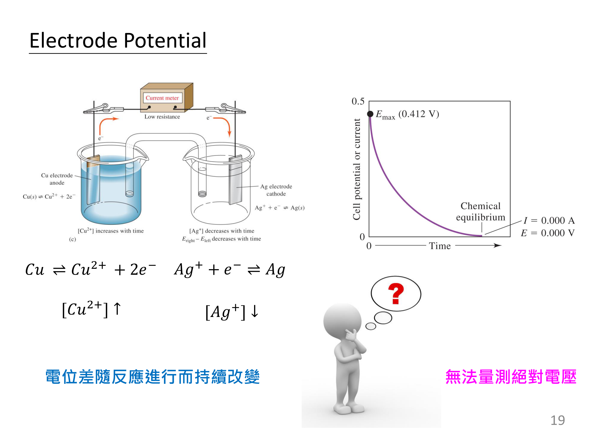

這頁跟 Page 7 的概念相同但更深入：

隨著電池反應進行：
- [Ag⁺] 下降（被還原消耗）
- [Cu²⁺] 上升（氧化產生）
- 電位差不斷改變

**核心觀念**：無法量測絕對電壓，只能量測相對電位差。

🔑 **記憶口訣**：**絕對電壓量不到，只能比對參考電極**

💡 **重點提示**：這就是為什麼所有的電化學量測都需要參考電極！沒有參考點，就沒辦法說「這個電極的電位是多少」。

---

## Page 18: SHE 參考電極

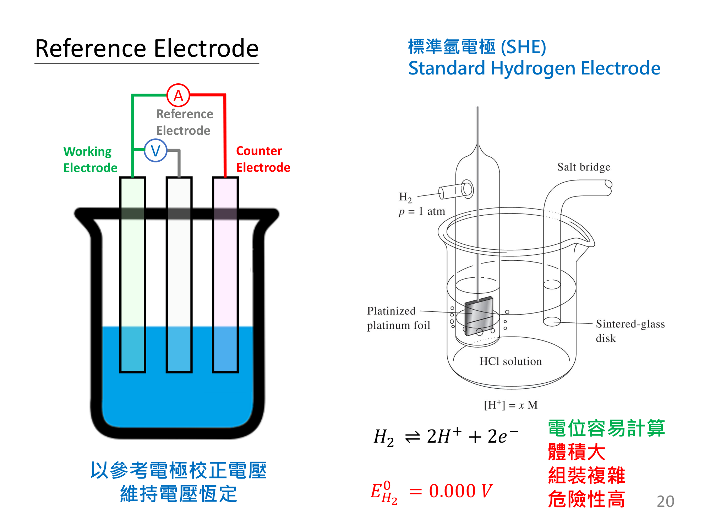

**SHE（標準氫電極）作為參考電極**

E° = 0.000 V（定義值）

三電極系統：
- **工作電極（Working Electrode）**：發生待測反應的電極
- **輔助電極（Counter/Auxiliary Electrode）**：導通電流迴路
- **參考電極（Reference Electrode）**：提供穩定電位基準

SHE 的優缺點：

| | 優點 | 缺點 |
|--|------|------|
| SHE | 電位容易計算（就是 0 V） | 體積大、組裝複雜、使用氫氣危險 |

🔑 **記憶口訣**：**工作看反應、輔助通電流、參考定基準**

💡 **重點提示**：SHE 是理論上的基準，但實際實驗中很少用，因為太麻煩又危險。我們用其他更方便的參考電極（下一頁開始介紹）。

---

## Page 19: SCE 飽和甘汞電極

**SCE = Saturated Calomel Electrode（飽和甘汞電極）**

反應：Hg₂²⁺ + 2Cl⁻ ⇌ Hg₂Cl₂
E° = 0.244 V（相對 SHE）

SCE 的組成：汞、甘汞（Hg₂Cl₂）、飽和 KCl 溶液

SCE 優缺點：

| | 優點 | 缺點 |
|--|------|------|
| SCE | 穩定、方便使用 | 內電阻大、含汞有毒 |

🔑 **記憶口訣**：**SCE = 飽和甘汞 = 0.244 V = 穩定但有毒**

💡 **重點提示**：因為含汞（環境毒性），現在很多實驗室已經不用 SCE，改用 Ag/AgCl 電極。但考試還是會考！

⚠️ **考試注意**：如果題目用 SCE 當參考電極，量到的電位要加上 0.244 V 才能換算成相對 SHE 的值。

---

## Page 20: Ag/AgCl 參考電極

**Ag/AgCl 電極**

反應：Ag⁺ + Cl⁻ ⇌ AgCl
E° = 0.197 V（相對 SHE，在飽和 KCl 中）

Ag/AgCl 優缺點：

| | 優點 | 缺點 |
|--|------|------|
| Ag/AgCl | 穩定、方便、體積小、內電阻小 | 需要定期補充 Cl⁻ 溶液 |

🔑 **記憶口訣**：**Ag/AgCl = 0.197 V = 小巧穩定但要補水**

💡 **比較三種參考電極**：

| 參考電極 | E° (V) | 優點 | 缺點 |
|---------|--------|------|------|
| SHE | 0.000 | 計算方便 | 體積大、危險 |
| SCE | 0.244 | 穩定方便 | 含汞有毒 |
| Ag/AgCl | 0.197 | 小巧穩定低電阻 | 需補Cl⁻ |

---

## Page 21: 工作電極

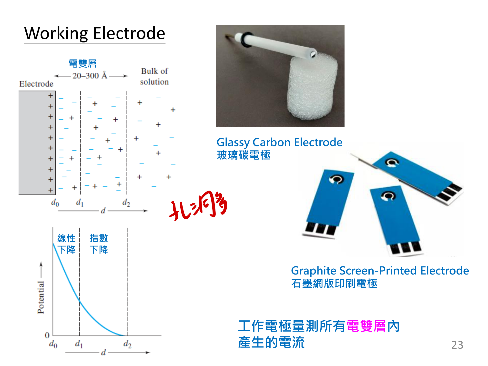

工作電極是三電極系統中真正發生待測反應的地方。

常見的工作電極材料：
- **玻璃碳電極（Glassy Carbon Electrode）**：導電性好、化學穩定、可拋光重複使用
- **石墨網版印刷電極（Graphite Screen-Printed Electrode）**：便宜、拋棄式、適合現場快速檢測

工作電極量測的是什麼？
- 電雙層（Electric Double Layer）內的電流
- 電雙層是電極表面和溶液之間形成的界面結構，像電容一樣

🔑 **記憶口訣**：**工作電極 = 反應發生的地方 = 量電流**

💡 **重點提示**：工作電極的材質和表面狀態會影響量測結果。拋光、活化、修飾都是常見的前處理步驟。

---

## Page 22: 三電極系統比較表

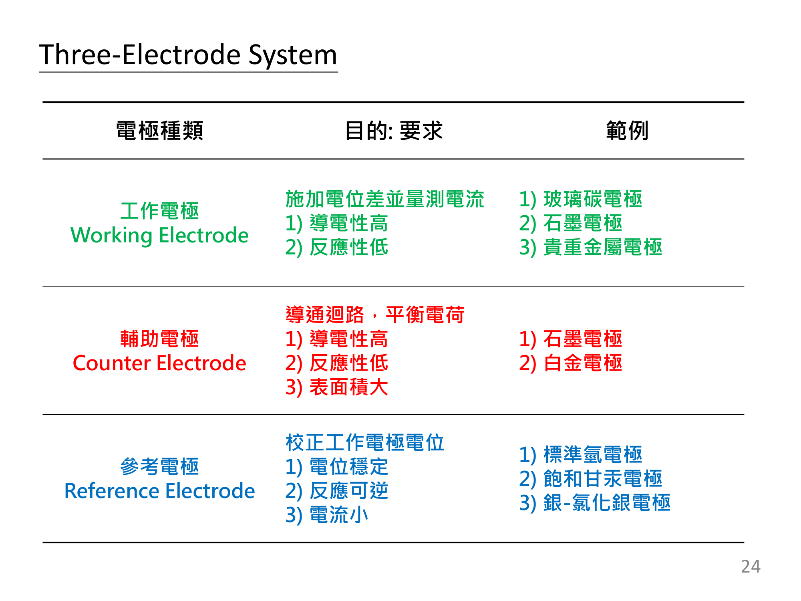

三電極系統各角色的功能：

| 電極 | 英文 | 功能 | 類比 |
|------|------|------|------|
| **工作電極** | Working Electrode | 量測電流（發生待測反應） | 運動員 |
| **輔助電極** | Counter/Auxiliary Electrode | 導通迴路（讓電流可以跑） | 跑道 |
| **參考電極** | Reference Electrode | 校正電位（提供穩定基準） | 裁判 |

為什麼需要三電極？
- 兩電極系統中，參考電極同時要通電流和提供電位基準，電流通過會影響電位
- 三電極系統把「通電流」和「量電位」分開，參考電極幾乎不通電流，電位更穩定

🔑 **記憶口訣**：**工作跑、輔助導、參考定**

⚠️ **常見陷阱**：輔助電極和參考電極不要搞混！輔助電極是幫忙通電流的，參考電極是幫忙量電位的。

---

## Page 23: 伏安法定義

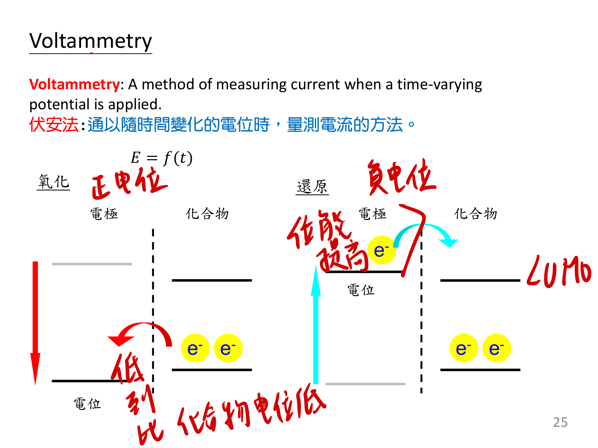

**伏安法（Voltammetry）**：施加時變電位（E = f(t)），同時量測電流的方法。

白話說：我們對工作電極施加一個隨時間變化的電壓，然後看電流怎麼跟著變。從電流-電位的關係圖（伏安圖）中，可以得到定性（什麼物質）和定量（多少）的資訊。

**氧化還原可逆性**：
- **可逆（Reversible）**：氧化態和還原態可以互相轉換，反應很快
- **不可逆（Irreversible）**：反應太慢或只能往一個方向跑

🔑 **記憶口訣**：**伏安法 = 電壓跑 + 看電流**

💡 **重點提示**：伏安法是整個電分析化學最核心的技術，後面的 LSV、CV、DPV、SWV 都是伏安法的變形。

---

## Page 24: LSV 線性掃描伏安法

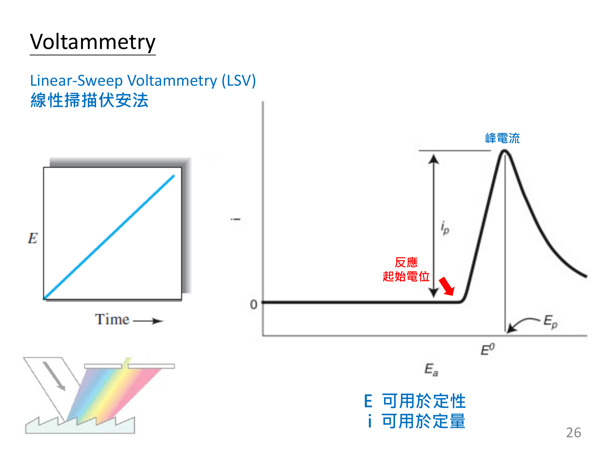

**LSV = Linear Sweep Voltammetry**

原理：電位從起始值以固定速率線性增加到結束值，同時量測電流。

LSV 圖上有兩個重要資訊：
- **峰電流 i_p（Peak Current）**：電流最大值 → **定量**（濃度越高，峰越高）
- **峰電位 E_p（Peak Potential）**：電流峰值對應的電位 → **定性**（不同物質在不同電位出峰）

🔑 **記憶口訣**：**LSV = 峰電流定量、峰電位定性**

白話說：就像爬山一樣，電壓從低到高慢慢掃過去。每種物質有自己的「山」（氧化峰），山的高度告訴你多少量，山的位置告訴你是什麼物質。

💡 **重點提示**：掃描速率（v）會影響峰電流大小，但不影響峰電位。掃越快，峰越高。

---

## Page 25: LSV 應用 — 紅酒分析

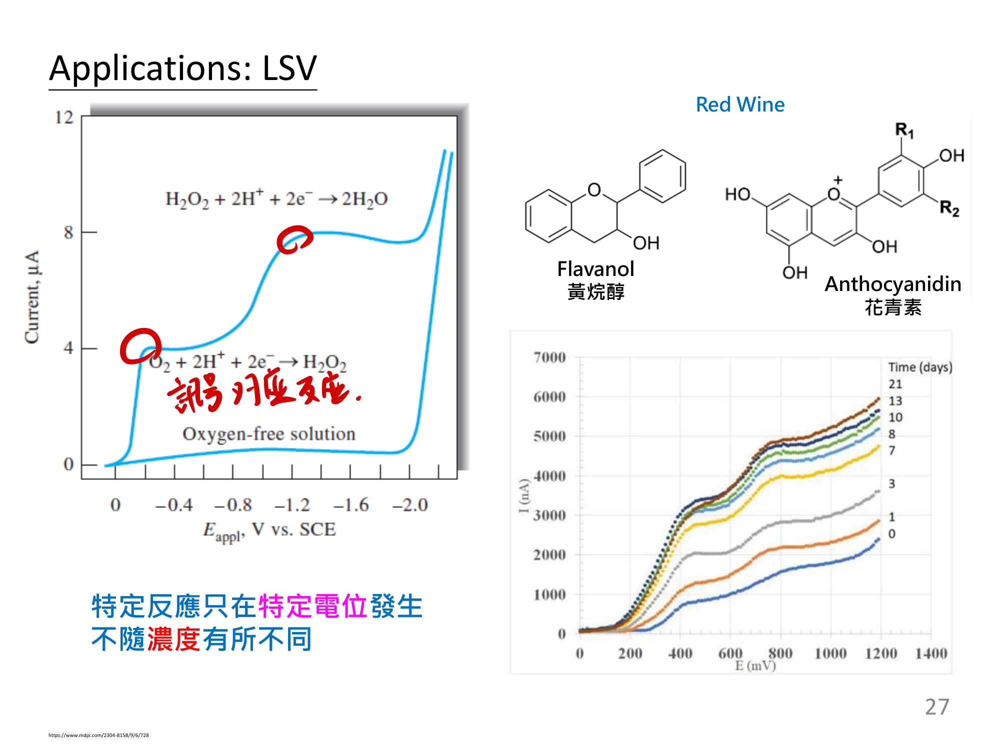

LSV 的實際應用：分析紅酒中的抗氧化成分

紅酒中含有：
- **Flavanol（黃酮醇）**：在特定電位產生氧化峰
- **Anthocyanidin（花青素）**：在不同電位產生氧化峰

因為不同物質的氧化還原電位不同，所以在 LSV 圖上會在不同位置出現峰。這就是「特定反應只在特定電位發生」的體現。

🔑 **記憶口訣**：**什麼電位出什麼峰 = 指紋辨識**

💡 **重點提示**：這也是為什麼選擇適當的電位範圍很重要。掃太窄可能漏掉某些物質的峰。

---

## Page 26: CV 循環伏安法

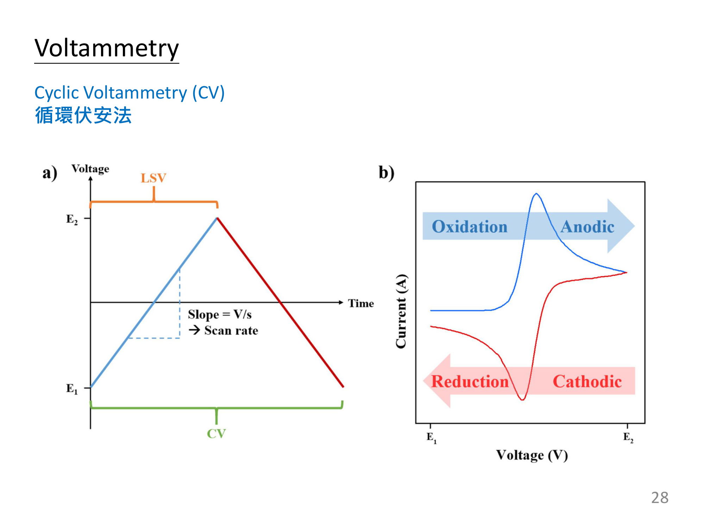

**CV = Cyclic Voltammetry（循環伏安法）**

CV 是 LSV 的進階版：電位不是只往一個方向掃，而是掃上去再掃下來，形成三角波。

掃描順序：
1. 從起始電位往正方向掃（氧化方向）→ 得到氧化峰
2. 到達轉折電位後往負方向掃（還原方向）→ 得到還原峰
3. 回到起始電位，完成一個循環

🔑 **記憶口訣**：**CV = 三角波 = 上山再下山**

💡 **重點提示**：CV 是電化學研究中最常用的技術之一，可以一次看到氧化和還原兩個方向的資訊。

---

## Page 27: CV 特點

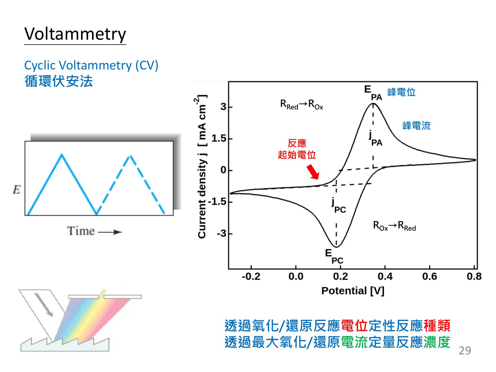

CV 圖上的兩個峰：

| 峰 | 方向 | 反應 |
|----|------|------|
| **氧化峰（Anodic Peak）** | 正向掃描 | RRed → ROx（還原態失去電子變氧化態）|
| **還原峰（Cathodic Peak）** | 反向掃描 | ROx → RRed（氧化態得到電子變還原態）|

兩個重要資訊：
- **E（峰電位）→ 定性**：不同物質的峰出現在不同電位
- **i（峰電流）→ 定量**：峰電流和濃度成正比

🔑 **記憶口訣**：**氧化往右（正電位方向）、還原往左（負電位方向）**

💡 **重點提示**：在 CV 圖中，x 軸是電位（通常左邊是負、右邊是正），y 軸是電流。注意電流的方向約定：氧化電流向上（正值），還原電流向下（負值）。有些教材畫法相反，要注意！

---

## Page 28: CV 可逆性判斷

CV 圖的形狀可以判斷反應的可逆性：

**可逆（Reversible）**：
- 氧化峰和還原峰對稱、大小差不多
- 峰分離 ΔE_p ≈ 59/n mV（25°C 時）
- 標準電位 E° = (E_氧化峰 + E_還原峰) / 2

**準可逆（Quasi-reversible）**：
- 峰分離比可逆大（超過 59/n mV）
- 圖形稍微不對稱

**不可逆（Irreversible）**：
- 只看得到一個方向的峰（只有氧化峰或只有還原峰）
- 反應太慢，來回掃描時來不及完成逆反應

🔑 **記憶口訣**：
- **可逆 = 對稱雙峰，E°取中間**
- **準可逆 = 峰分離變大**
- **不可逆 = 單峰獨行**

💡 **重點提示**：E° = (E_O + E_R) / 2 這個公式只對可逆反應成立！考試常考。

⚠️ **常見陷阱**：判斷可逆性看的是峰的形狀和分離，不是峰的高度！

---

## Page 29: Randles-Ševčík 方程式

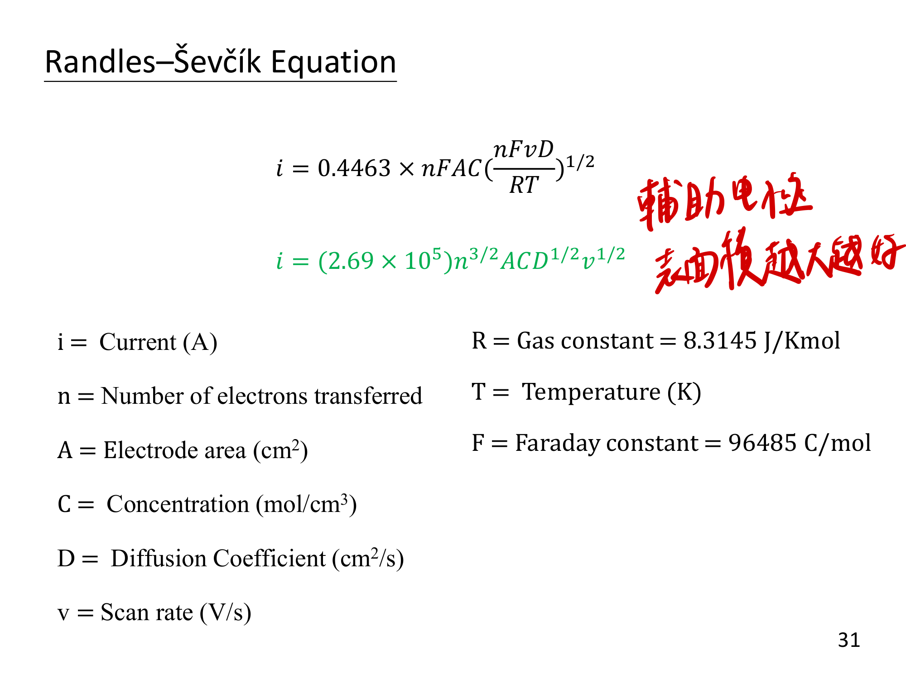

**Randles-Ševčík 方程式**是 CV 定量分析的基礎：

**i_p = (2.69 × 10⁵) × n^(3/2) × A × C × D^(1/2) × v^(1/2)**

各符號意思：
- i_p：峰電流（A）
- n：轉移電子數
- A：電極面積（cm²）
- C：分析物濃度（mol/cm³）
- D：擴散係數（cm²/s）
- v：掃描速率（V/s）

🔑 **記憶口訣**：**i 正比於 n^1.5 × C × v^0.5**

從這個公式可以看出：
1. 峰電流和濃度成正比 → 這是定量的基礎
2. 峰電流和掃描速率的平方根成正比 → 掃越快，峰越高
3. 峰電流和轉移電子數的 1.5 次方成正比 → 電子數越多，峰越大

💡 **重點提示**：如果 i_p 對 v^(1/2) 作圖是一條直線，代表是擴散控制的反應（可逆條件）。

---

## Page 30: CV 應用 — 普魯士藍和鐵氰化鉀

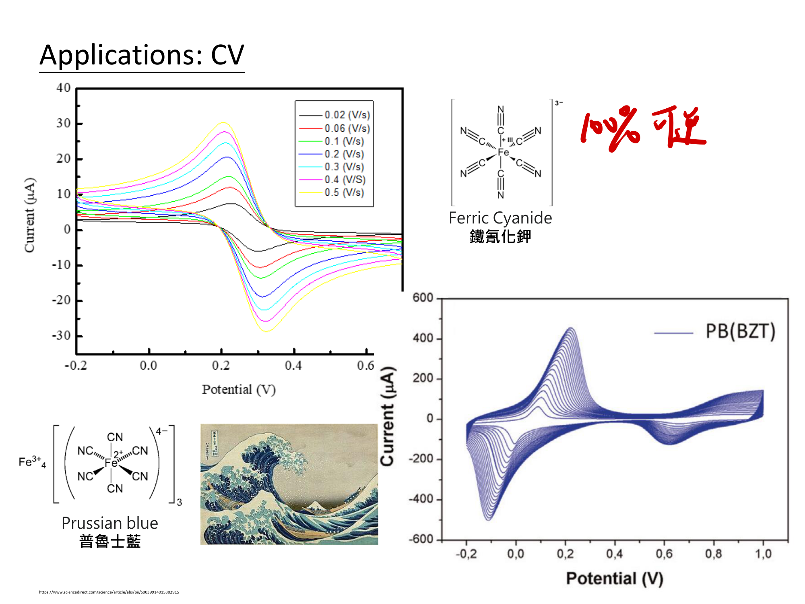

兩個經典的 CV 範例：

**普魯士藍（Prussian Blue）**：
- 是一種配位化合物，Fe(III) 和 Fe(II) 之間的氧化還原
- CV 圖上可以看到明顯的氧化還原峰對
- 用於電化學感測器和電致色變元件

**鐵氰化鉀 [Fe(CN)₆]³⁻/⁴⁻**：
- 這是 CV 實驗最常用的標準品！
- Fe(III) 和 Fe(II) 之間的單電子轉移
- 可逆性好、峰形漂亮，常用來測試電極和儀器

🔑 **記憶口訣**：**鐵氰化鉀 = CV 實驗的標準品 = 學 CV 必做**

💡 **重點提示**：鐵氰化鉀的 CV 圖是考試最愛考的可逆 CV 範例，要能畫出標準的鴨嘴形（duck-shaped）CV 圖。

---

## Page 31: DPV 和 SWV

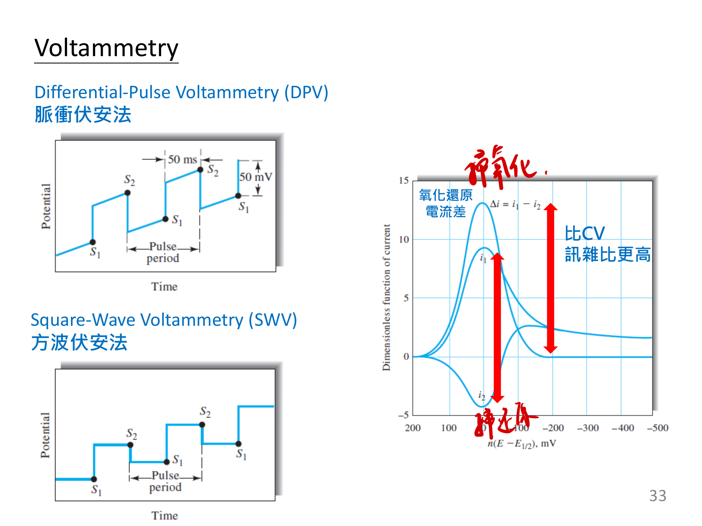

**DPV = Differential Pulse Voltammetry（微分脈衝伏安法）**
**SWV = Square Wave Voltammetry（方波伏安法）**

這兩種方法比 CV 有更高的訊雜比（S/N ratio），適合微量分析。

**DPV 的原理**：
- 在線性掃描的基礎上，每一段時間疊加一個小脈衝
- 量測脈衝前後的電流差（Δi）
- 因為充電電流衰減快，法拉第電流衰減慢，取差值可以消除大部分的充電電流

**SWV 的原理**：
- 用方波形狀的電位波形
- 結合了正向和反向的電流資訊
- 比 DPV 更快，訊雜比也更高

🔑 **記憶口訣**：**DPV = 微分脈衝、SWV = 方波，都比 CV 安靜（訊雜比高）**

💡 **重點提示**：DPV 和 SWV 的圖形不像 CV 有峰有谷，而是像波浪線，每個對應一個氧化還原反應。

---

## Page 32: DPV & SWV 應用 — 亞甲基藍

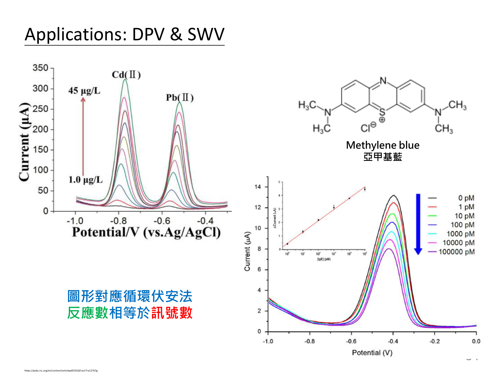

亞甲基藍（Methylene Blue）的 DPV/SWV 分析：

- 亞甲基藍是一種氧化還原指示劑，有明確的氧化還原反應
- DPV/SWV 的圖形和 CV 的峰可以對應
- **反應數 = 訊號數**：有幾個氧化還原反應，就有幾個峰

🔑 **記憶口訣**：**幾個反應 = 幾個峰**

💡 **重點提示**：DPV 和 SWV 比 CV 靈敏很多，可以偵測到更低的濃度。如果 CV 看不到的微量成分，試試 DPV 或 SWV。

---

## Page 33: 定電位安培法

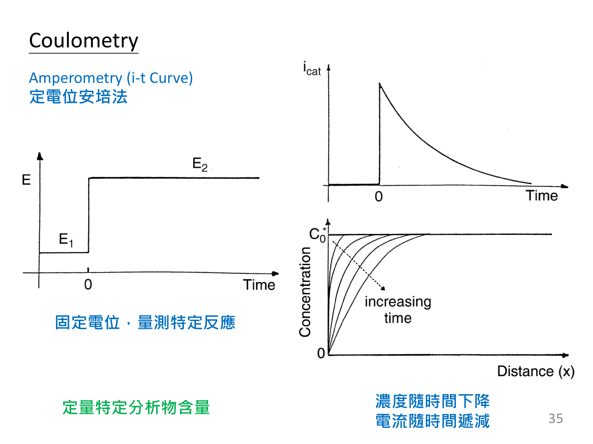

**定電位安培法（Amperometry at Fixed Potential）**

原理：把電位固定在一個值，然後量測電流隨時間的變化（i-t curve）。

i-t curve 的特徵：
- 電流一開始很大（剛開始反應）
- 隨時間遞減（擴散層變厚，物質傳輸變慢）
- 最終趨近穩定值

🔑 **記憶口訣**：**定電位安培法 = 固定電壓看電流隨時間變化**

白話說：就像你把水龍頭開到一個固定位置，然後看水流怎麼隨時間變化。一開始水很大，慢慢變小。

💡 **重點提示**：定電位安培法的好處是選擇性高。你選對電位，就只量測你想要的反應，其他物質不干擾。但缺點是如果選錯電位，就什麼都量不到。

---

## Page 34: 電位選擇 — 多成分分析

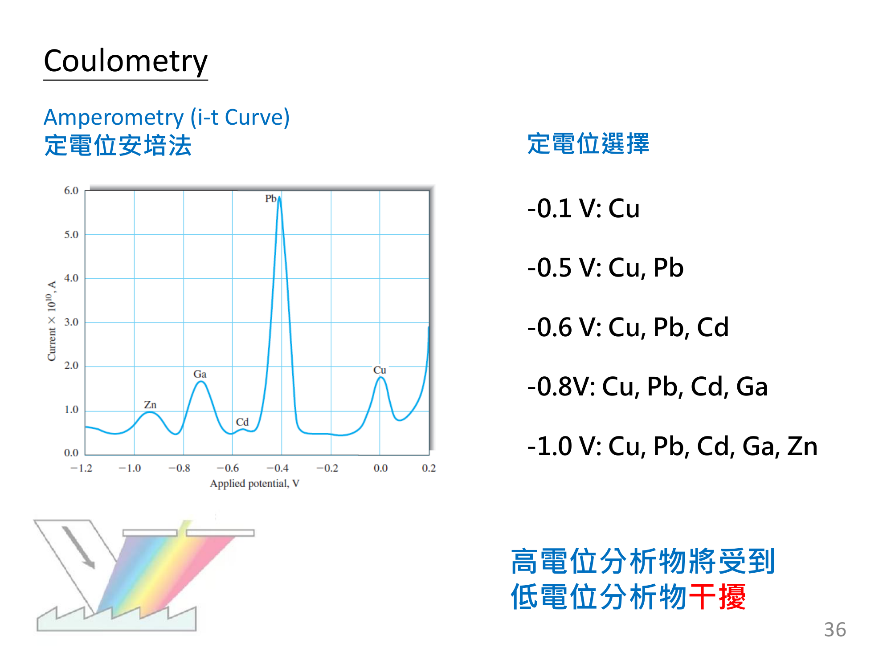

這頁非常重要！不同電位可以看到不同物質：

| 施加電位 | 可以偵測的物質 |
|----------|-------------|
| -0.1 V | Cu |
| -0.5 V | Cu + Pb |
| -0.6 V | Cu + Pb + Cd |
| -0.8 V | Cu + Pb + Cd + Ga |
| -1.0 V | 全部 + Zn |

規律：**電位越負，能偵測的物質越多**

⚠️ **重要觀念**：高電位（較正）的物質會在低電位（較負）也被偵測到。所以如果你在 -0.5 V 量到電流，那可能是 Cu 或 Pb 或兩者都有。

🔑 **記憶口訣**：**電位越負，偵測越多；低電位干擾高電位**

💡 **重點提示**：要單獨偵測某個物質，要選一個它會反應但比它難還原的物質不會反應的電位。例如要單獨偵測 Cu，用 -0.1 V。

---

## Page 35: 抗壞血酸定電位安培法

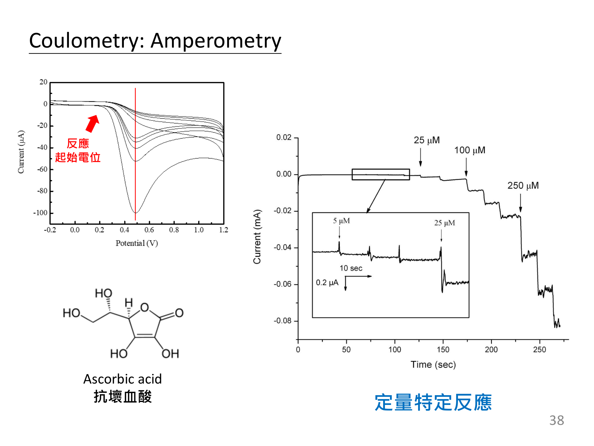

實際應用：用定電位安培法定量抗壞血酸（維生素 C）

原理：
- 抗壞血酸在特定電位會被氧化
- 把電位固定在這個值，量測電流
- 電流大小和抗壞血酸濃度成正比

這就是定電位安培法的核心：**固定電位 → 選擇性偵測特定反應 → 電流定量**

🔑 **記憶口訣**：**定電位 = 選對頻道聽特定電台**

💡 **重點提示**：定電位安培法常用於感測器設計，例如血糖計、神經傳導物質偵測等。選對電位是關鍵！

---

## Page 36: Summary 總結

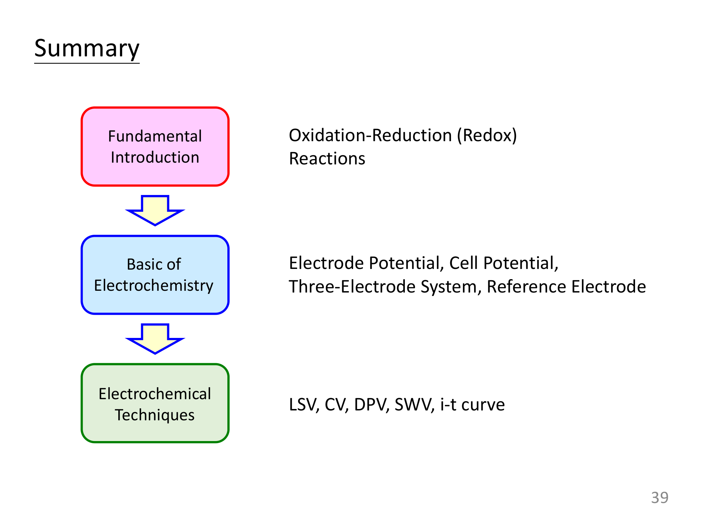

整個 Chapter 22-25 的重點回顧：

**1. 氧化還原基礎**
- 氧化 = 失電子、還原 = 得電子
- 陰極還原、陽極氧化

**2. 電極電位 & Cell Potential**
- E_cell = E_right - E_left
- SHE = 0.000 V（基準）
- 正電位 = 自發、負電位 = 非自發
- 標準電極電位五大重點

**3. Nernst 方程式**
- E = E° - (0.0592/n)log(Q)
- 非標準狀態必用！

**4. 三電極系統 & 參考電極**
- 工作、輔助、參考各有功能
- SHE、SCE、Ag/AgCl 三種參考電極比較

**5. 伏安法家族**
- LSV：線性掃描，i定量、E定性
- CV：三角波，判斷可逆性
- DPV/SWV：高訊雜比，微量分析
- 定電位安培法：i-t curve，選擇性偵測

🔑 **期末必背清單**：
1. Plus Right Rule
2. E_cell = E_right - E_left
3. Nernst 方程式（完整版 + 25°C 簡化版）
4. SHE = 0.000 V, SCE = 0.244 V, Ag/AgCl = 0.197 V
5. 三電極各角色
6. Randles-Ševčík 方程式
7. 可逆性判斷（ΔE_p ≈ 59/n mV）

---

## Page 37: Thank You + Good Luck with Final

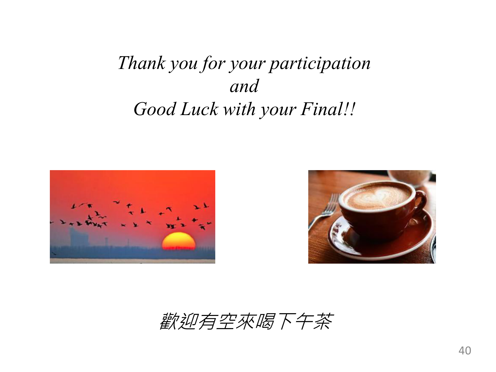

加油！期末考加油！💪

---

## Page 38-40: Review 定義和公式

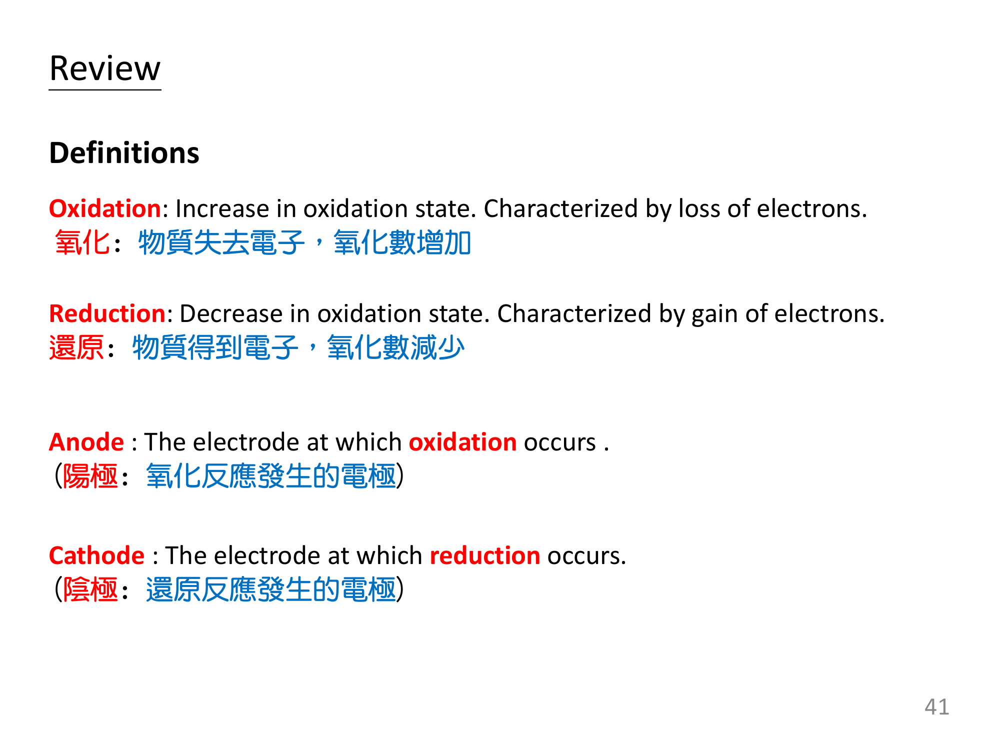
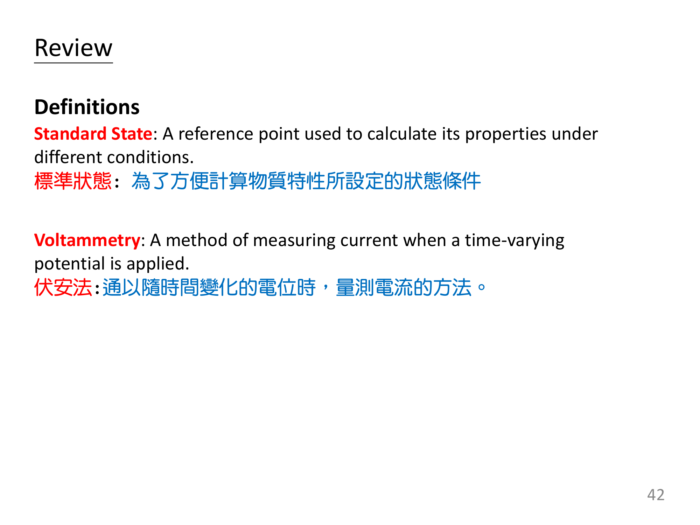
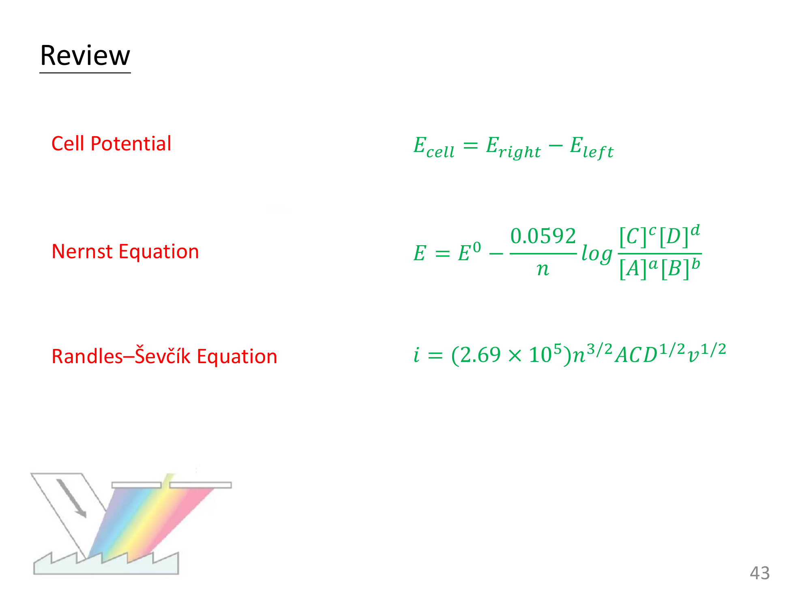

### 必背公式總整理

**1. Nernst 方程式**
E = E° - (RT/nF) × ln(Q)
25°C 簡化版：E = E° - (0.0592/n) × log(Q)

**2. 電池電位**
E_cell = E_right - E_left
E_cell = E_cathode - E_anode（自發電池）

**3. Randles-Ševčík 方程式**
i_p = (2.69 × 10⁵) × n^(3/2) × A × C × D^(1/2) × v^(1/2)

**4. 可逆 CV 判斷**
ΔE_p = 59/n mV（25°C）
E° = (E_氧化峰 + E_還原峰) / 2

**5. 標準電極電位**
SHE: E° = 0.000 V
SCE: E° = 0.244 V
Ag/AgCl: E° = 0.197 V

**6. 電化學電池表示法**
陽極 | 陽極溶液 || 陰極溶液 | 陰極
左 = 氧化（Anode）
右 = 還原（Cathode）

### 必背定義總整理

| 術語 | 定義 |
|------|------|
| 氧化 | 失去電子，氧化數增加 |
| 還原 | 得到電子，氧化數減少 |
| 陽極 Anode | 發生氧化的電極 |
| 陰極 Cathode | 發生還原的電極 |
| 標準狀態 | 1 M, 1 atm, 25°C |
| 標準電極電位 | 相對 SHE 的還原電位 |
| 伏安法 | 施加時變電位量測電流 |
| LSV | 線性掃描伏安法，i定量E定性 |
| CV | 循環伏安法，三角波 |
| DPV | 微分脈衝伏安法，高訊雜比 |
| SWV | 方波伏安法，高訊雜比 |
| 定電位安培法 | 固定電位量測 i-t curve |

### 記憶口訣總複習

1. **LEO says GER**：失電子 = 氧化，得電子 = 還原
2. **Cat還An氧**：Cathode = 還原，Anode = 氧化
3. **左氧右還**：電池表示法左邊氧化右邊還原
4. **Plus Right Rule**：正極接右邊
5. **正=自發、負=非自發**
6. **SHE 是海平面 = 0.000 V**
7. **莫耳數不影響 E°**
8. **峰電流定量、峰電位定性**
9. **可逆 = 對稱雙峰、E° 取中間**
10. **電位越負偵測越多**

---

> 🌙 祝期末順利！這份筆記涵蓋了所有 40 頁投影片的內容，每頁都有截圖、白話解釋、計算拆解和記憶口訣。加油！